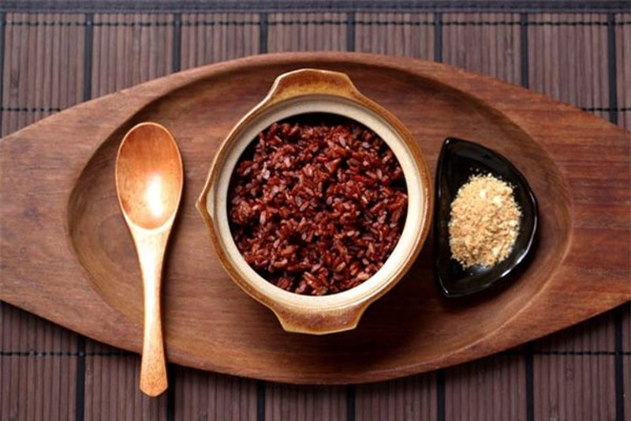
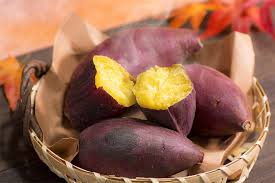

# Ăn uống tối giản

Đối với những người độc thân, việc ăn uống tối giản tương đối đơn giản. Nhưng đây thực sự là vấn đề lớn với người đã có gia đình, có con nhỏ, và nhà có đông thành viên. Nếu như quần áo, mỹ phẩm v.v… mang tính cá nhân, ta có thể tối giản nó theo ý mình, thì việc ăn uống lại không như vậy. Biết vậy, nhưng mình vẫn viết bài này, để chia sẻ cách nhìn của mình về việc ăn uống tối giản. Hi vọng sẽ có ích cho những bạn muốn sống tối giản mà chưa biết nên bắt đầu từ đâu, và như thế nào. 

Ăn uống tối giản khác ăn uống đơn giản. Nó không phải kiểu nấu một món thật nhiều, xong bỏ tủ lạnh, hàng ngày lấy ra ăn dần. Cả tuần ăn hết món đó. Sang tuần làm món khác, rồi lại ăn cả tuần. Cá nhân mình thấy, làm thế không khoa học và ảnh hưởng tới sức khoẻ.

### Những điều nên làm rõ khi ăn uống

Cho dù bạn ăn uống tối giản hay phức tạp, muốn đảm bảo được sức khoẻ, hàng ngày bạn đều phải nạp vào cơ thể 4 nhóm: tinh bột, protein, xơ và chất béo. 

Tinh bột giúp cung cấp năng lượng, tức là khiến bạn nhiều sức lực hơn, khoẻ mạnh hơn, vì vậy nên ăn nhiều vào buổi sáng. Nó sẽ khiến bạn có sức làm việc cả ngày. Không nên ăn nhiều tinh bột vào buổi tối, vì sau bữa tối, cơ thể ít vận động, năng lượng nạp vào cơ thể không có cơ hội được tiêu hao, sẽ gây béo và tích mỡ. 

Protein nuôi dưỡng cơ bắp cho cơ thể. Nên ăn nhiều hơn vào buổi trưa.

Và chất xơ thì nên ăn nhiều vào buổi tối, để việc nghỉ ngơi tốt hơn, ngủ dễ hơn. 

Ăn uống tối giản chủ yếu thể hiện ở việc tối giản trong cách chế biến. Thay vì làm những món phức tạp với rất nhiều loại gia vị, thì hãy làm những món được chế biến đơn giản, ít gia vị. Mục đích: 1: tiết kiệm thời gian, 2: lưu giữ lại hương vị và chất dinh dưỡng của nguyên liệu.

Cách chế biến nên là luộc, hấp, áp chảo … thay vì chiên rán nhiều dầu mỡ. Theo nghiên cứu mà mình đã đọc ở đâu đó, thì hấp là phương pháp giữ lại nhiều chất dinh dưỡng nhất.

  

  

Nhóm tinh bột mà mình hay nạp vào người nhất gồm: gạo lứt, khoai lang, yến mạch. 

Gạo lứt nấu cơm như bình thường, khoai lang thường chỉ cần luộc, và yến mạch thì mình cho nước nóng và xay cùng chuối.

Nhóm protein yêu thích của mình là ức gà và cá hồi. Ngoài ra còn có bột đậu xay, thăn lợn, thịt bò.

Mình thường chế biến thịt gà bằng cách luộc lên và ăn cùng tương ớt hoặc muối chanh. Cũng có lúc ướp gà với gia vị, dầu hào, xì dầu, tiêu trong khoảng 10 phút rồi áp chảo.

Đối với thịt lợn, mình thường cũng chỉ luộc. Tuy nhiên sẽ có lúc xào hoặc hấp. Còn thịt bò, thì phải xào là chắc rồi. 

Đối với nhóm xơ, món mình hay làm là các thể loại rau luộc và sa lát. Thi thoảng có xào rau để đổi món. 

Ngoài rau, mình còn uống thêm sinh tố. Hôm nào ngại xay thì cứ hoa quả mà chén thôi. 

Còn chất béo, mình dùng dầu ô liu, và nạp vào cơ thể thông qua các món áp chảo, sa lát, xào. Ngoài ra, còn có 1 số loại hạt và hoa quả giàu chất béo tự nhiên như lạc, bơ v.v…

### Những câu hỏi xoay quanh việc ăn uống tối giản

#### 1. Ăn uống tối giản là kham khổ?

Mình khẳng định là không. Nếu chịu khó thay đổi thực đơn, thì nó không hề kham khổ chút nào. Mà thực sự cách ăn nào cũng sẽ trở nên rất kham khổ nếu không thay đổi thực đơn.

#### 2. Ăn uống tối giản là khắc khổ?

Khắc khổ khác kham khổ nhé. Khắc khổ là bạn phải ép bản thân vào quy chuẩn, một cách rất khắc nghiệt.

Mình thấy, ăn uống tối giản là khắc khổ khi và chỉ khi bạn **_thực hiện nó theo phong trào, không xuất phát từ việc bạn thật sự muốn thế, bạn cảm thấy không hạnh phúc khi làm thế_**.

Còn mình, mình thấy thoải mái khi ăn như vậy. Mà nếu mình có cảm thấy không hứng thú nữa, thì thi thoảng có thể dành một bữa để ăn mấy món nhiều bơ, cheese mà mình thích. Không sao hết. Hãy relax bản thân hihi …. 

#### 3. Ăn uống tối giản có phải là chỉ luộc, hấp, áp chảo?

Đây là 3 cách chế biến được khuyến khích dùng thôi. Còn bạn vẫn có thể xào, chiên, nhưng hãy dùng dầu oliu nhiều hơn dầu thực vật thông thường. 

Gần đây thấy có bán loại nồi chiên không dầu, không cần tí dầu nào mà vẫn chiên giòn tan được cơ mà. Nên không cần phải quá nguyên tắc đâu nhé. 

#### 4. Mọi người đều nên ăn uống tối giản?

Không có 1 quy chuẩn đúng nhất nào để có thể áp dụng với tất cả mọi người. Nếu xét về mặt dinh dưỡng, đúng là mọi người đều nên ăn như vậy. Nhưng nếu xét về mặt cá nhân, thì nếu bạn không cảm thấy thoải mái, không hạnh phúc khi làm vậy, bạn không cần làm theo.

#### 5. Ăn uống tối giản có phải là eat clean

Chính xác luôn haha. Thực ra mình không có ý định thay thế khái niệm đâu. Mình chỉ muốn nhìn khái niệm eat clean theo hướng khác mà thôi. 

Ngoài ra, mình thấy có nhiều bạn hỏi: “ăn thế này có phải eat clean không?” hoặc có bạn nói “eat clean là phải thế kia thế kia”. Nếu nhìn eat clean theo hướng tối giản thì không có gì là PHẢI cả. Nguyên tắc nó là vậy, còn mỗi cá nhân hãy áp dụng nó phù hợp với mình. Mình hiểu bản thân mình nhất mà, đúng không? 

#### 6. Người ăn uống tối giản không biết nấu nướng lắm?

Ừ thì có vẻ như thế thật. Suốt ngày quanh đi quẩn lại chỉ luộc, hấp, áp chảo. Thi thoảng mới thấy xào. Người ta làm món nọ món kia, gia vị nọ kia tưng bừng, đây chỉ có ướp mỗi muối + tiêu, có món còn chả cho gia vị gì. 

Cá nhân mình thấy, đây là vấn đề của sự lựa chọn. Nếu bạn lựa chọn cách ăn đơn giản mà vẫn đảm bảo dinh dưỡng, lại đỡ tốn thời gian, vậy thì hãy ăn tối giản. Nếu bạn muốn chọn cách ăn mà phong phú về thực đơn, rèn luyện tay nghề bếp núc … thì hãy đi theo hướng bạn thích. 

Mà thực ra, bắt tay vào rồi mới thấy, nếu để tâm thì ai cũng có thể trở thành chuyên gia ẩm thực tối giản. Chắc chắn luôn. 

Cá nhân mình thấy ẩm thực Việt Nam là đỉnh cao của nghệ thuật ăn uống tối giản.

Ví dụ nhé: thịt gà không cần phải chế biến gì nhiều. Con gà nuôi chạy ngoài vườn, thịt chắc. Chỉ cần luộc lên và chấm muối chanh ớt, là đã ngon lắm rồi. Ở các nước khác, thịt gà hầu hết là nuôi công nghiệp, thịt không chắc và không thơm đâu nha.

Hoặc như món gỏi cuốn thường thấy trong miền Nam. Chỉ cần ít thịt luộc, mà không có thịt thì cá hấp cũng được. Gói cùng các loại rau, thêm ít bún và chấm với nước mắm pha. Một chiếc gỏi cuốn mà đầy đủ cả tinh bột, protein, xơ, béo. Không có món nào khác trên thế giới được như vậy đâu.

Nói vậy để thấy, tối giản không phức tạp, và nó đã ở ngay bên cạnh ta mà ta không biết mà thôi.

## Nấu ăn đơn giản cho gia đình

Lúc đầu mình tính ghi là NẤU ĂN TỐI GIẢN, nhưng mà bản thân mình cũng không hiểu rõ nấu ăn tối giản là sao. Đọc tài liệu thì nghe nó hơi hơi kiểu một thể loại nghệ thuật gì đấy. Thôi gọi là đơn giản cho nó...đơn giản ^^. 

Trước đây mình mất cả buổi để nấu ăn và không làm được gì thêm cả nên hôm nào nghĩ tới cảnh đó là cả nhà đi ăn ngoài luôn. Hôm nào mình về trễ là cả nhà  cũng đói luôn vì chả biết nấu cái gì với đống đồ trong tủ lạnh. Đi chợ thì toàn đi lúc đói nên mua tá lả, về dùng không hết để thừa mứa mốc meo uổng phí lắm. Mình khá là bận nhưng cũng khá là tham lam. Muốn nhanh gọn, nhưng phải đủ chất, nóng hổi, ngon lành. vậy nên mình áp dụng một số cách sau: 

- LÊN THỰC ĐƠN TRƯỚC: khâu này mình thoải mái sáng tạo theo khẩu vị gia đình nhưng cơ bản là đủ 3 món (canh, xào, mặn), nhiều rau và trái cây, thiên về các món hấp xào luộc (ăn thức ăn ít chế biến sẽ giữ được nhiều chất hơn á), và mình chỉ lên thực đơn cho thứ 2,3 và 4 thôi, còn thứ 5,6,7 thì giống t2,3,4, riêng chủ nhật cả nhà mình sẽ ăn chay. Viết xong mình dán ngay lên cửa tủ lạnh để nhìn vô là biết nấu gì, khỏi nghĩ mắc công  
- ĐI CHỢ VÀ SƠ CHẾ VÀO SÁNG CHỦ NHẬT: Sau khi đã có thực đơn thì mình viết ra các món cần mua và chỉ mua nhiêu đó thôi. Tùy theo sức ăn của gia đình mà mình mua với số lượng vừa nhất, hoặc ít 1 tí cũng được còn hơn là để thừa mứa. mình đi chợ và sơ chế vào sáng chủ nhật và chuẩn bị cho cả tuần. Các loại rau củ mình rửa sạch và tùy loại mình sẽ cắt sẵn luôn. Thịt tôm cá mực thì mình sơ chế và ướp sẵn luôn, bỏ tủ đá lúc nấu chỉ cần lấy ra bỏ vào xoong là nấu thôi. 
- HỘP ĐỰNG THỰC PHẨM: với việc chuẩn bị sẵn thức ăn cả tuần thì hộp đựng vô cùng quan trọng. Mình chọn hộp nhựa có nắp kín khí, nhựa thật tốt, trên thị trường có nhiều loại lắm. giá tầm 80k tới 300k tùy kích cỡ, dùng rất tốt và bền. cái gì xác định dùng lâu dài thì mua loại thật tốt vô. 
- SỮA VÀ TRÁI CÂY: Mình cho con uống sữa hạt ở nhà, ở trường các cháu có sữa học đường rồi. hạt mình ngâm và sơ chế vào chủ nhật luôn rồi chia hộp cấp đông, mình có máy nấu và sáng dậy sớm bỏ vô máy nấu 30p là được 2L uống cả ngày. Trái cây thì ưu tiên mấy trái ít đường và nhanh như dâu, cam, chuối, táo, ổi. 
- MÓN NHANH GỌN: Trong tuần sẽ có vài ngày bận và về trễ thì mình chọn món nhanh gọn dễ nấu: bò kho bánh mì, cháo sườn, gà tiềm rau củ với mì, thịt luộc cuốn rau bún... mình có nồi nấu chậm. đồ ăn đã sơ chế và ướp rồi. trước khi đi làm bỏ tất vô nồi nấu, thêm nước rồi vặn nhiệt độ tự động. chiều tối về là nêm lại rồi múc ra ăn thôi. Tuyệt vời! 

Xong xuôi rồi thấy nhàn vô cùng luôn. Mỗi lần nấu nướng chỉ mất tầm 30p cả dọn dẹp, lúc nào mình họp đột xuất về trễ thì chồng mình cứ nhìn vô thực đơn, lấy đồ đã sơ chế trong tủ ra là nấu thôi. Chuẩn bị sẵn như vầy thì đi làm về đỡ ngán, không tụt mood mà bỏ đi ăn quán nữa. cả nhà cùng ăn những món yêu thích. Nấu cũng vừa đủ, ăn xong rửa chén cũng nhàn nữa. Một tuần nhà mình chỉ tiêu khoảng 500k đồ ăn cho nhà 2 người lớn 2 trẻ em. 

Mình từng thử các chuẩn bị đồ ăn (meal prep) như của mấy food blogger nước ngoài, tức là nấu sẵn luôn rồi lúc ăn chỉ cần hâm nóng lại. nhưng nhà mình thích ăn kiểu Việt, đồ ăn nấu mới nóng hổi cơ. Với lại nấu ăn cho cả nhà mình nấu sẵn hết rồi chia hộp thì tủ lạnh nhà mình không chứa nổi, mà lỡ có việc đột xuất thì đồ ăn nấu rồi k để được lâu. Vậy nên mình chọn câch sơ chế trước và khi cần mới nấu. 

Mình chia sẻ chung chung thôi chứ không nói rõ thực đơn gia đình mình vì mỗi gia đình có hoàn cảnh khác nhau và các chị em có sự sáng tạo và khẩu vị khác nhau. Nhưng hi vọng giúp được cho chị em nào đó ngoài kia đang bối rối vì việc nấu ăn.

## Nguồn

- [Tối giản trong ăn uống – Life 30](https://life30.vn/an-uong-kieu-toi-gian/)
- [NẤU ĂN ĐƠN GIẢN CHO CẢ GIA ĐÌNH](https://www.facebook.com/minimalismvietnam/posts/1061393697381525/)
