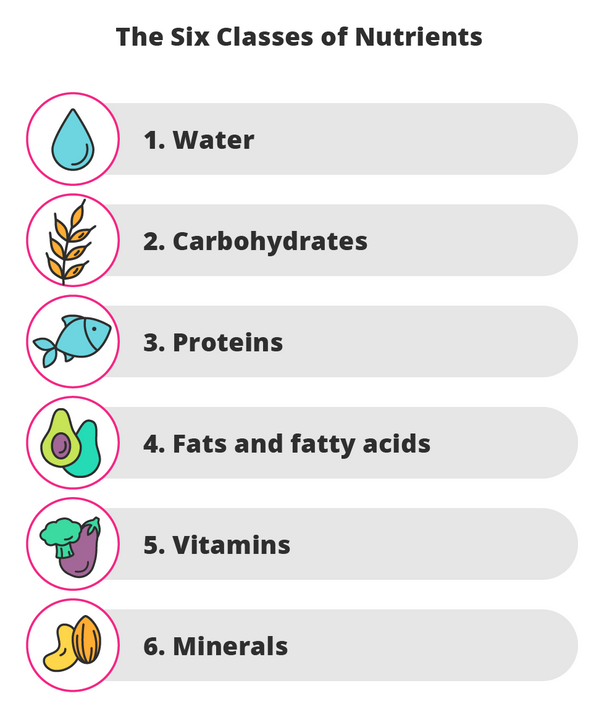
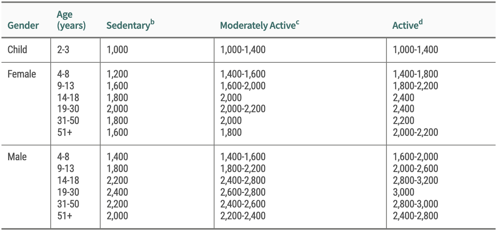
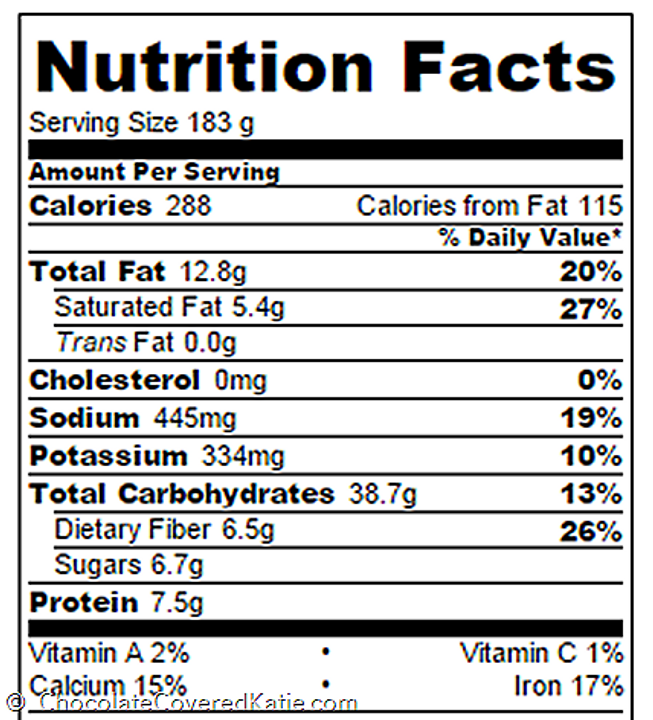
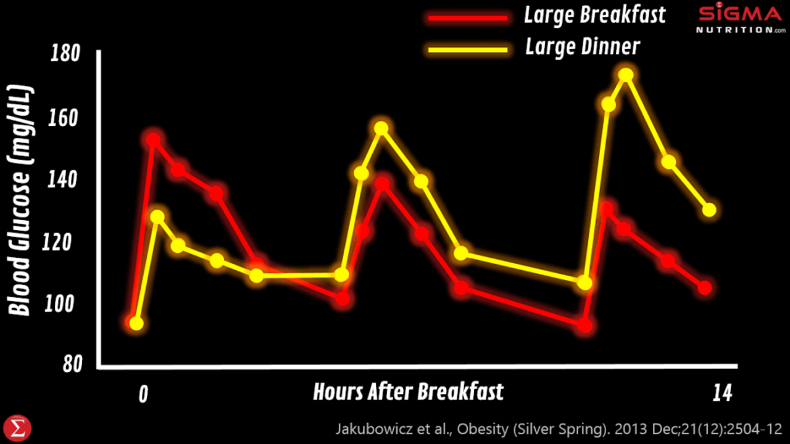
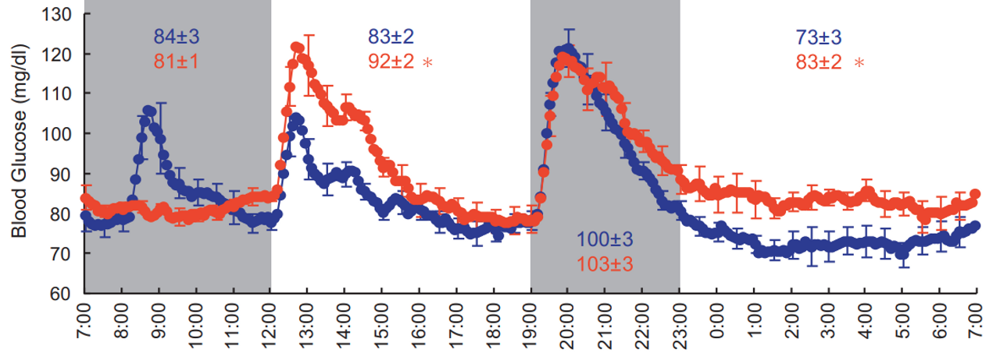
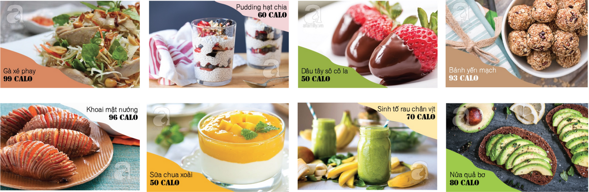
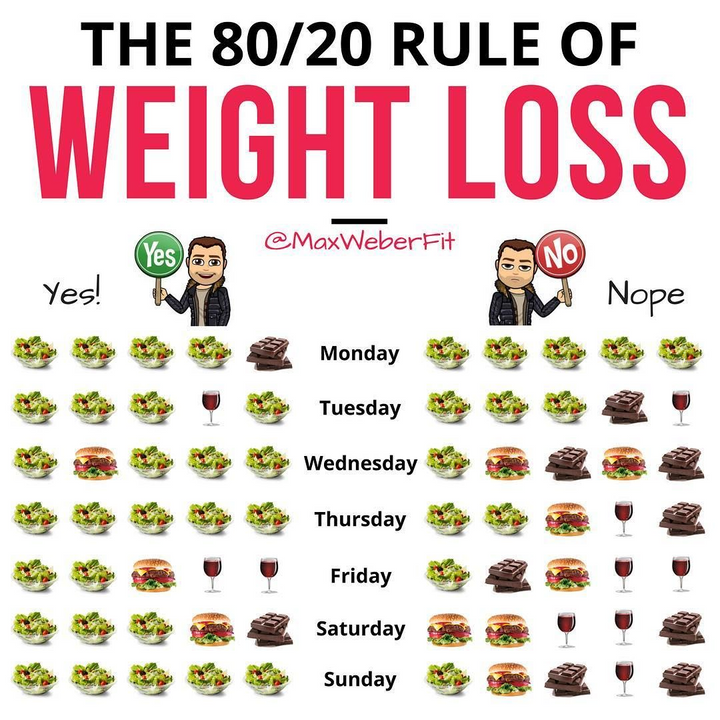

# Chế độ ăn

!!! info "Nguồn bài viết"
[Cơ thể cân đối bắt đầu từ... một bữa ăn](https://spiderum.com/bai-dang/Co-the-can-doi-bat-dau-tu-mot-bua-an-qrMIuFJalccR)

<iframe width="560" height="315" src="https://www.youtube.com/embed/B3hfkqyLINk?si=jBLnzPHtC7IEKFFH" title="YouTube video player" frameborder="0" allow="accelerometer; autoplay; clipboard-write; encrypted-media; gyroscope; picture-in-picture; web-share" referrerpolicy="strict-origin-when-cross-origin" allowfullscreen></iframe>

Hôm nọ, mình có đọc qua một bài báo đề cập về chủ đề sức khỏe - một chủ đề mà mình khá quan tâm. Bài viết có một câu chia sẻ rất tâm đắc, rằng "**Nằm viện 72 ngày, bán cả 2 căn biệt thự ở trung tâm thành phố, tôi mới nhận ra nếu còn khỏe mạnh, dù chỉ với hai bàn tay trắng, tôi đã là tỷ phú triệu đô**". Câu chữ ấy giúp mình vững tin hơn về những thứ mà mình đang theo đuổi đồng thời nó cũng là nguồn động lực thôi thúc mình cho ra lò bài viết này. Hy vọng với những thứ mà mình chia sẻ sẽ phần nào đó giúp anh em nhà nhện chúng ta có thêm một góc nhìn khác về bữa ăn hàng ngày hoặc ít nhất là có thêm một tí cảm hứng để bắt tay vào xây dựng bữa ăn phù hợp với mình hơn.

Có một điều không thể phủ nhận đó là những thứ được nạp vào cơ thể hàng ngày đóng một vai trò rất quan trọng đối với sức khỏe của chúng ta. Để làm chủ bữa ăn cũng như xây dựng được một chế độ ăn phù hợp với bản thân, trước tiên chúng ta cần hiểu "sương sương" những thứ mà mình sẽ ăn, đồng thời chúng ta cần phải học lắng nghe cơ thể của mình để biết được điều gì phù hợp với cơ thể bởi vì bạn là duy nhất và cơ địa của bạn cũng vậy.

Dựa trên nội dung của buổi workshop "Dinh dưỡng ứng dụng trong cuộc sống" của MSc Ngô Thị Ngọc Hương, mình sẽ xây dựng bài viết theo bố cục "tiêu chí ăn 3 đủ và 5 đúng".

## 3 tiêu chí ăn đủ

### 1. Đủ dinh dưỡng

Có 6 nhóm chất dinh dưỡng cần thiết cho cơ thể khỏe mạnh, bao gồm: nước, đường tinh bột (carbohydrates), đạm, chất béo "tốt", vitamin và khoáng chất. Mình sẽ đi qua những điều mà mình thấy thú vị và đáng lưu tâm của từng nhóm chất một.

#### Nước

Chúng ta đã được nghe quá nhiều về công dụng của nước như hỗ trợ quá trình trao đổi chất, quá trình giảm cân, duy trì thân nhiệt, giúp làn da tươi sáng, cải thiện tâm trạng,... và đầy rẫy những bài post hoặc các page trên Facebook lập ra để nhắc nhở bạn uống đủ nước mỗi ngày. Vậy thì uống nước như nào mới chuẩn? Có phải ai cũng cần uống 2-2,5L nước mỗi ngày không?

Nước ấm từ 25-30 độ là lựa chọn tối ưu để đánh thức cơ thể vào mỗi sáng, các thời điểm khác trong ngày chúng ta nên uống nước bình thường (khoảng 12-15 độ). Ngoài ra không nên uống nước quá lạnh vì nhiệt độ cơ thể sẽ bị thay đổi đột ngột, ảnh hưởng xấu đến sức khỏe nhất là trong lúc vận động, cơ thể đang được "làm nóng".

Có 2 loại nước mà chúng ta cần nạp vào cơ thể đó là nước tự do và nước liên kết. Nước tự do là nước mà chúng ta uống hàng ngày, nếu được uống lúc cơ thể đang khát thì nước tự do sẽ đi thẳng vào tế bào, còn nước liên kết (có trong các rau, củ, quả) cần một khoảng thời gian để được giải phóng. Cung cấp kết hợp cả 2 loại nước này giúp cơ thể có thể giữ nước được tốt hơn và luôn được đủ nước. Việc uống từ 2-2,5L nước mỗi ngày là đúng nhưng chưa đủ, còn tùy thuộc vào nhiều yếu tố khác đặc biệt là cơ địa và mức độ hoạt động trong ngày của mỗi người. Nhưng làm gì thì làm, nhớ ăn trái cây nhé.

Hãy chủ động cung cấp nước cho cơ thể trước khi cảm thấy khát, dưới đây là các thời điểm đặc biệt cần uống nước:

#### Đường tinh bột

Đường tinh bột (carbohyrates/carb) là nguồn nguyên liệu chính cung cấp năng lượng cho cơ thể, đặc biệt những ai thích vận động thì không thể không có carb trong người. Carb gồm 3 loại chính: đường, tinh bột và chất xơ. Hầu hết các loại carb đều được chuyển hoá thành glucose để cung cấp năng lượng cho cơ thể, trừ chất xơ - loại carb không bị "chặt" thành glucose (do cơ thể con người không có những enzyme cần thiết để tiêu hóa chất xơ như một số loài động vật ăn cỏ) nhưng chất xơ hỗ trợ cơ thể rất tốt trong việc làm sạch hệ tiêu hoá.

**Carb "xấu" (Refined/Simple Carb)**: carb đã qua tinh chế và mất đi một phần hoặc hoàn toàn chất xơ, vi chất dinh dưỡng.

_VD: Gạo chà xát đánh bóng hết cám, đồ uống có đường, bánh mì trắng, bánh ngọt,..._

**Carb "tốt" (Whole Carb)**: carb chưa qua tinh chế và còn giữ được chất xơ, vi chất dinh dưỡng.

_VD: Ngũ cốc nguyên cám, rau, củ, quả, đậu tây, đậu Hà Lan, quả hạnh nhân, óc chó, đậu phộng hạt điều,..._

Nếu bạn thừa quá nhiều cân, gặp một số vấn đề liên quan đến hệ trao đổi chất hoặc bệnh tiểu đường loại 2 thì cần chú ý nhiều đến nhóm chất dinh dưỡng này. Trên thực tế, chỉ có loại carb “xấu” mới thực sự liên quan đến béo phì, còn loại carb "tốt" giàu chất xơ thì rất có lợi cho sức khỏe. Do đó, không thể đánh đồng các loại carb như nhau, để hễ cứ ăn kiêng giảm cân, là quay mặt với carb.

Một số bạn theo chế độ Low-carb một cách mù quáng và không khoa học, loại bỏ carb trong chế độ ăn mà không biết lượng carb tối ưu mà có thể nạp vào cơ thể phụ thuộc vào nhiều yếu tố như giới tính, độ tuổi, hoạt động thể chất, cơ địa,... Nếu không ăn carb trong thời gian dài dễ dẫn đến nguy cơ mắc các bệnh như rối loạn chuyển hóa lipid máu, hoạt động thể chất chậm chạp.

> Carb đâu có tội tình gì, quan trọng là carb loại nào thôi.

#### Đạm

Đạm (protein) là chất dinh dưỡng quan trọng giúp bạn nuôi dưỡng phục hồi và xây dựng các tế bào cơ. Protein được chia thành 2 loại chính:

- Protein hoàn chỉnh: chứa tất cả 9 axit amin thiết yếu mà cơ thể không thể tự sản xuất được. Loại này chủ yếu có nguồn gốc từ động vật (_thịt, cá, trứng, sữa,..._) và một số loài thực vật (_Quinoa, hạt lúa mạch đen,hạt chia, hạt gai dầu, tảo xoắn,..._).

- Protein không hoàn chỉnh: không có đủ những axit amin thiết yếu. Loại này chủ yếu có nguồn gốc từ thực vật (_đậu Hà Lan, đậu, ngũ cốc,..._). Những loại protein thực vật phần lớn chỉ cung cấp axit amin không thiết yếu nhưng bù lại giúp giảm cholesterol xấu, giảm huyết áp cao, giúp bạn có một hệ tim mạch khỏe.

Chúng ta nên tiêu thụ đa dạng các loại protein để tối ưu hóa việc cung cấp chất dinh dưỡng cho cơ thể. Việc thiếu protein có thể dẫn đến các tình trạng như: suy giảm miễn dịch, cơ thể bị phù nề, khó ngủ, tâm trạng thất thường,... Thừa protein cũng gây ra các hậu quả xấu như đau khớp, bệnh gout, rối loại tiêu hoá, hơi thở có mùi, tăng cân,...

Bạn sẽ cần nạp khoảng 0.8 - 3g protein/kg cân nặng, tùy thuộc vào nhiều yếu tố như giới tính, độ tuổi, hoạt động thể chất, cơ địa,...

#### Chất béo

Chất béo (lipid) đóng vai trò thiết yếu trong quá trình hấp thụ một số vitamin để thúc đẩy các chức năng khác nhau trong cơ thể. Trong não bộ, chất béo chiếm đến 60% thành phần vật chất, ảnh hưởng trực tiếp đến quá trình **xử lý tín hiệu và truyền dẫn thần kinh**. Nếu như chúng ta cảm thấy mình có vẻ quá nhiều mỡ rồi thì có nên loại bỏ chất béo ra khỏi khẩu phần ăn không? Câu trả lời là KHÔNG, chúng ta vẫn phải nạp vào cơ thể chất béo nhưng mà là chất béo "tốt". Có thể chia chất béo thành 2 nhóm:

**Chất béo "xấu":** có hại và tác hại đối với sức khỏe, bao gồm:

- Chất béo bão hòa (Saturated Fat): có thể làm tăng nồng độ cholesterol trong máu và nồng độ lipoprotein tỷ trọng thấp (LDL), còn được gọi là cholesterol “xấu”. Phần lớn chất béo bão hòa là chất béo động vật (_thịt và da của gia súc/gia cầm, mỡ lợn, sữa nguyên kem, bơ, phô mai, kem, kem chua, kem tươi,....)_. Đây là loại chất béo gây tranh cãi khá nhiều, có nhiều nghiên cứu mới cho thấy thì chất béo bão hòa không phải là nguyên nhân gây nên béo phì. Nhưng với hiệp hội tim mạch Mỹ thì ngược lại và yêu cầu chỉ nên ăn dưới 10% lượng tiêu thụ mỗi ngày.
- **Chất béo chuyển hóa (Trans Fat)**: có thể làm tăng nồng độ LDL (cholesterol “xấu”) và giảm nồng độ lipoprotein tỷ trọng cao (HDL) (cholesterol “tốt”). Nguồn thực phẩm chứa chất béo chuyển hóa bao gồm: _bánh quy, bánh ngọt, bánh rán, thực phẩm chiên, đồ ăn vặt chế biến sẵn,..._

**Chất béo "tốt":** có lợi cho sức khỏe, tốt cho tim mạch, bao gồm:

- Chất béo không bão hòa đơn (Monounsaturated Fat): có thể cải thiện nồng độ cholesterol trong máu và giảm nguy cơ mắc bệnh tim mạch, có trong _bơ, bơ đậu phộng và bơ hạnh nhân, các loại hạt quả hạch (hạnh nhân, hạt điều, quả phỉ và quả hồ đào), dầu thực vật (dầu ô liu, dầu cải dầu và dầu đậu phộng),..._
- Chất béo không bão hòa đa (Polyunsaturated Fat): còn được gọi là “chất béo thiết yếu”, rất quan trọng đối với sức khỏe vì cơ thể không thể tự sản sinh ra mà phải hấp thụ từ thực phẩm. Tương tự như chất béo không bão hòa đơn, chất béo không bão hòa đa làm giảm nguy cơ mắc bệnh tim mạch thông qua giảm nồng độ cholesterol trong máu. Loại chất béo này có trong _đậu tương rang và bơ hạt đậu nành, hạt hướng dương, hạt bí ngô, hạt vừng, dầu thực vật (dầu ngô, dầu hoa rum, dầu vừng và dầu hướng dương), các loại hạt quả hạch (quả óc chó, quả hồ đào, hạt quả hạch Brazil và hạt thông),..._

Axit béo **omega-3** là loại chất béo không bão hòa đặc biệt, giúp giảm nguy cơ mắc bệnh động mạch vành và hỗ trợ trong việc giảm nồng độ triglyceride và hạ huyết áp. Axit béo omega-3 có trong cá trích, cá hồi, cá mòi, cá hồi vân, hạt chia, quả óc chó, dầu cá,...

- Thay thế các chất béo bão hòa bằng các chất béo không bão hòa nhằm cải thiện mức cholesterol tốt trong máu.

- Hạn chế sử dụng thức ăn nhanh.

- Giới hạn lượng thịt đỏ (bò, heo,...) tiêu thụ, thay vào đó hãy ăn thịt trắng (cá, gà,...), đạm thực vật.

- Sử dụng dầu ô-liu khi nấu ăn, trộn salad,...

- Chọn thức ăn nhẹ tốt cho sức khỏe thay vì bánh quy, khoai tây chiên.Sử dụng bơ thực vật thay vì bơ cứng.

> Chất béo rất quan trọng nhưng quan trọng hơn đó phải là chất béo tốt.

#### Vitamins và khoáng chất

Vitamins và khoáng chất là hai vi chất dinh dưỡng thiết yếu giúp cho cơ thể bạn phát triển và hoạt động bình thường. Có nhiều vitamin, mỗi loại có tác dụng khác nhau với cơ thể, để có thể lựa nhanh thực phẩm và áp dụng vào bữa ăn một cách đơn giản, mình thường lựa chọn thực phẩm theo màu sắc, mỗi màu sắc của thực phẩm sẽ có một tính chất đặc trưng như sau:

- Trắng: tăng cường hệ miễn dịch
- Vàng: cải thiện tinh thần (đặc biệt là trái chuối), củng cố độ đàn hồi da.
- Cam: hỗ trợ tốt cho các vết thương, ngăn chặn sự viêm nhiễm.
- Đỏ: hỗ trợ tốt cho tim, mạch máu.
- Tím: bảo vệ hệ thần kinh (đặc biệt tốt cho chị em phụ nữ).
- Xanh: thanh lọc cơ thể, thải độc.

### 2. Đủ năng lượng

Tùy vào giới tính, độ tuổi, mức độ hoạt động, cơ địa,... của mỗi người mà chúng ta có thể ước tính lượng calo cần nạp vào mỗi ngày, qua đó chúng ta có thể điều chỉnh khẩu phần ăn để làm chủ cân nặng của mình. Để nhanh, gọn, lẹ, các bạn có thể tìm kiếm với từ khoá "[Calorie Calculator](https://www.calculator.net/calorie-calculator.html)" để tìm những trang web tính toán lượng calo cần nạp mỗi ngày chính xác nhất.

Lượng calo từ các chất dinh dưỡng chính:

- 1g protein = 4 calories
- 1g Carbohydrate = 4 calories
- 1g chất béo = 9 calories
- 1g cồn = 7 calories (câu trả lời cho câu hỏi vì sao uống bia bị béo bụng)

Ngoài ra mình có thói quen đọc thông tin dinh dưỡng trên các bao bì sản phẩm để biết được phần nào các thành phần có trong sản phẩm, nếu thấy có xuất hiện hàm lượng chất béo chuyển hoá (**Trans Fat**) > 0g thì mình không dùng.

### 3. Đủ hiểu biết

Không cần những hiểu biết quá cao siêu mà chỉ cần biết những kiến thức cơ bản là bạn có thể làm chủ được các bữa ăn hàng ngày của mình. Khi chúng ta ăn, chúng ta cần phải biết mình đang ăn cái gì, có tác động như thế nào đến cơ thể. Đủ hiểu biết để có đủ tự tin trong việc chọn lựa thực phẩm, không chạy theo những quảng cáo trông có vẻ uy tín và đầy hứa hẹn của nền công nghiệp thực phẩm.

> Thực phẩm là thuốc hoặc cũng có thể là thuốc độc nếu ăn không đúng cách.

## 5 tiêu chí ăn đúng

### 1. Đúng giờ

Lúc còn bé, mỗi khi mình mải chơi mà quên cả ăn, luôn luôn sẽ có một giọng nói vang lên khiến mình không bao giờ quên được "Mấy giờ rồi mà chưa chịu đi ăn cơm nữa? Không sợ bị đau bao tử hả?" Vâng, không ai khác đó chính là mẫu thân của mình. Lúc ấy mình cũng chả quan tâm gì mấy đến việc đó, mãi sau này mình mới hiểu ra cơ thể của chúng ta cũng có khung giờ làm việc riêng của nó hay còn gọi là "nhịp sinh học" (circadian rhythm). Ăn uống một cách tùy hứng sẽ làm gián đoạn "nhịp sinh học" của cơ thể, gây ảnh hướng đến quá trình tiêu hoá. Theo một nghiên cứu được công bố bởi tạp chí nghiên cứu khoa học "Proceedings Of The Nutrition Society", những người có thói quen ăn uống đúng giờ ít bị béo phì hơn, và duy trì lượng cholesterol, đường máu và insulin tốt hơn.

Ngoài ra, tuyến tụy chính là cơ quan bị ảnh hưởng nhiều nhất nếu bạn ăn không đúng giờ. Tuyến tụy là nơi tiết ra Insulin và Glucagon - 2 loại hormone giúp điều hoà đường huyết.

- Insulin hỗ trợ điều chỉnh sự chuyển hóa carbohydrate, chất béo và protein bằng cách thúc đẩy sự hấp thụ glucose từ máu vào tế bào gan, mỡ và cơ xương, hiểu nôm na là giúp giảm đường huyết về mức cân bằng, chất này khá quen thuộc với các bạn có người nhà bị tiểu đường.

- Glucagon hỗ trợ tăng nồng độ glucose và axit béo trong máu, hiểu nôm na là giúp nâng đường huyết lên về mức câng bằng.

Ăn uống thất thường sẽ làm cho quá trình điều hoà đường huyết của tuyến tụy bị ảnh hưởng (mình sẽ nói rõ hơn ở phần kế), lâu ngày dễ dẫn đến bệnh tiểu đường loại 2.

> Ăn không đúng bữa, ngủ không đúng giờ mà cứ đòi gặp đúng người đúng thời điểm. Ai cho!

### 2. Đúng bữa

Chúng ta sẽ có nhiều bữa ăn trong ngày và không phải tất cả các bữa đều được ăn như nhau. Vậy thì giữa các bữa ăn trong ngày có gì khác nhau? Dưới đây là biểu đồ so sánh lượng đường huyết của cơ thể với 2 chế độ ăn khác nhau:

1. Large breakfast: 700kcal vào bữa sáng, 600kcal vào bữa trưa và 200kcal vào buổi tối
2. Large dinner: 200kcal vào bữa sáng, 600kcal vào bữa trưa và 700kcal vào buổi tối

Việc ăn nhiều vào buổi sáng giúp duy trì lượng đường huyết ổn định hơn và thấp hơn khoảng 20% so với chế độ ăn thứ 2 - large dinner, nhờ đó tuyến tụy của chúng ta cũng hoạt động ít "vất vả" hơn. Bên cạnh đó, buổi tối là thời điểm cơ thể ít vận động nhất, nếu chúng ta ăn các loại thức ăn giàu năng lượng sẽ dễ dẫn đến việc cơ thể chuyển hóa năng lượng thừa thành mỡ.

Bữa sáng - bữa ăn quan trọng nhất trong ngày và thường bị thế hệ "gen Z" chúng ta bỏ qua nhiều nhất. Dưới đây là biểu đồ so sánh lượng đường huyết của cơ thể có ăn sáng (màu xanh) và cơ thể không ăn sáng (màu đỏ):

Sau khi chúng ta thức dậy, cơ thể cần một lượng năng lượng để có thể hoạt động một cách hiệu quả và bữa sáng sẽ giải quyết vấn đề đó. Ngoài ra, từ biểu đồ ta có thể thấy rằng việc ăn sáng giúp duy trì lượng đường huyết của cơ thể ổn định hơn và thấp hơn từ lúc ăn trưa cho đến hết ngày. Nhiều nghiên cứu cho thấy bữa ăn sáng có ảnh hướng lớn đến sức khỏe, giúp chúng ta tập trung và ghi nhớ tốt hơn, làm giảm lượng cholesterol "xấu" và ít có nguy cơ gặp các vấn đề về tim mạch, tiểu đường hoặc thừa cân.

### 3. Đúng lượng

Số lượng bữa ăn và lượng thức ăn nạp vào cơ thể cũng là một yếu tố quyết định trong quá trình xây dựng cơ thể cân đối. Từ xưa đến nay, người Việt Nam chúng ta thường chỉ chú trọng đến 3 bữa ăn chính: sáng, trưa và chiều (hoặc tối), thói quen này lâu ngày dẫn đến tuyến tụy của chúng ta sẽ không được khỏe. Hiểu một cách đơn giản thì sau khi chúng ta ăn, đường huyết sẽ tăng cao và sau đó chúng ta làm việc, lượng đường huyết sẽ giảm xuống dần tới mức rất thấp cho đến bữa ăn kế tiếp (như 2 biểu đồ vừa nãy cho thấy). Khi các bữa ăn của chúng ta cách nhau một khoảng thời gian dài như vậy dẫn đến độ chênh lệch giữa đường cao và đường thấp rất lớn, bắt buộc tuyến tụy phải tiết ra một lượng lớn glucagon hoặc insulin để điều hòa đường huyết lại mức cân bằng. Khi chúng ta chia nhỏ bữa ăn hoặc có các bữa phụ xen kẽ thì biên độ dao động của đường huyết sẽ nhỏ, tuyến tụy cũng không cần phải hoạt động quá "vất vả" để điều hòa đường huyết, nhờ vậy mà "tuổi thọ" của tuyến tụy sẽ được kéo dài hơn. Số lượng bữa ăn tiêu chuẩn trong ngày thường là 5-6 bữa (theo tiêu chuẩn của hội Eat Clean Việt Nam).

Gợi ý các món ăn cho bữa phụ :

Sử dụng tỉ lệ bữa ăn tiêu chuẩn (1/2 rau, 1/4 đạm, 1/4 tinh bột "tốt") để kiểm soát lượng thức ăn nạp vào cơ thể.

Đối với Việt Nam chúng ta, gạo trắng chính là nguồn cung cấp tinh bột chính cho cơ thể trong các bữa ăn bởi lẽ từ ngàn đời nay, cây lúa đã gắn bó với con người, làng quê Việt Nam đồng thời cũng trở thành tên gọi cho một nền văn minh - nền văn minh lúa nước. Tuy nhiên, gạo trắng mà chúng ta ăn hàng ngày thuộc nhóm tinh bột "xấu", đã bị mất đi khá nhiều các dưỡng chất. Để tối ưu lượng dinh dưỡng trong bữa ăn hàng ngày và giảm nguy cơ mắc bệnh tiểu đường loại 2, bệnh tim mạch, béo phì,... chúng ta nên thay gạo trắng bằng các loại thực phẩm thuộc nhóm tinh bột "tốt" như các loại ngũ cốc nguyên cám, gạo lứt, gạo đen, gạo đỏ,... Đối với đạm, nếu ăn thịt thì các bạn nên ưu tiên thịt trắng và hãy cố gắng đa dạng các loại rau - củ - quả nạp vào cơ thể. Ngoài ra bạn cũng nên nạp một lượng hạt bằng ngón tay cái để bổ sung chất béo lành mạnh nhé.

### 4. Đúng cơ địa

Chọn thực phẩm để ăn cũng có phần giống với việc chọn người yêu, không cần là người tốt nhất, chỉ cần đó là người phù hợp nhất. Thực phẩm mà mọi người ai cũng bảo là tốt, chưa chắc đã hợp với bạn, nhưng những thứ hợp với bạn chắc chắn sẽ là thứ tốt nhất. Sẽ không có một khẩu phẩn ăn mẫu hay tiêu chuẩn nào cho chúng ta cả, như ở đầu bài viết mình có nói: bạn là duy nhất và cơ địa của bạn cũng vậy. Việc mà bạn cần làm không phải là lên mạng tìm kiếm các khẩu phần mẫu, trông có vẻ "healthy" và "balance" rồi áp dụng lên cơ thể của mình mà là lắng nghe cơ thể và rồi tự tìm cho bản thân một chế độ ăn phù hợp nhất.

> Không cần là thứ tốt nhất, chỉ cần đó là thứ phù hợp nhất.

### 5. Đúng tài chính

Thực phẩm đắt không phải lúc nào cũng tốt và loại tốt không phải lúc nào cũng đắt. Một ví dụ điển hình đó là khoai lang - một thực phẩm có giá thành khá thấp so với nguồn dinh dưỡng mà nó mang lại. Chúng ta nên chọn những loại thực phẩm phù hợp với túi tiền sao cho chúng ta có thể duy trì được chế độ ăn hàng một cách dễ dàng, từ đó có mới có thể xây dựng một cơ thể cân đối bền vững.

Các loại thực phẩm giúp tăng đề kháng, tiết kiệm chi phí nên có trong nhà:

- Chuối: hỗ trợ tốt cho việc phát triển cơ đối với các bạn thích vận động, giúp ổn định tâm trạng (nhất là đối với các chị em phụ nữ),...

- Khoai lang: chứa nhiều vitamin và chất khoáng, chất xơ, chất chống oxi hóa,...

- Mật ong: uống mật ong chanh nóng vào mỗi sáng rất tốt cho sức khỏe, nướng thịt rất ngon.

- Thơm: hàm lượng vitamin C cao, có thể dùng để nấu ăn.

- Bí đao: thanh lọc năng lượng xấu trong người, mang ít calo.

- Cam, chanh, bưởi, quýt: giàu vitamin C, ngon.

## Kết bài - nguyên tắc 80/20

Kết quả của một cơ thể cân đối, khỏe mạnh đến từ:

- 80% thực phẩm bạn ăn
- 20% cách thức bạn vận động

Mình không bao giờ bó buộc bản thân vào một chế độ ăn nghiêm ngặt nào cả, bên cạnh phần lớn các bữa ăn "healthy" thì mình vẫn "quẩy" nhiệt tình ở các buổi ăn chơi hoặc những lần nuông chiều bản thân, tiêu thụ các loại thực phẩm không "healthy" cho lắm. Điều này sẽ giúp cho tâm trạng của mình dễ chịu hơn, không quá cầu kỳ trong ăn uống, lâu dần hình thành được thói quen ăn uống tốt, có lợi cho sức khỏe.

Cuối cùng, quan trọng hơn hết vẫn là bạn phải biết cách áp dụng những thứ mình biết vào trong các bữa ăn, học lắng nghe, quan sát cơ thể để biết cơ thể bạn thật sự cần gì, muốn gì.
