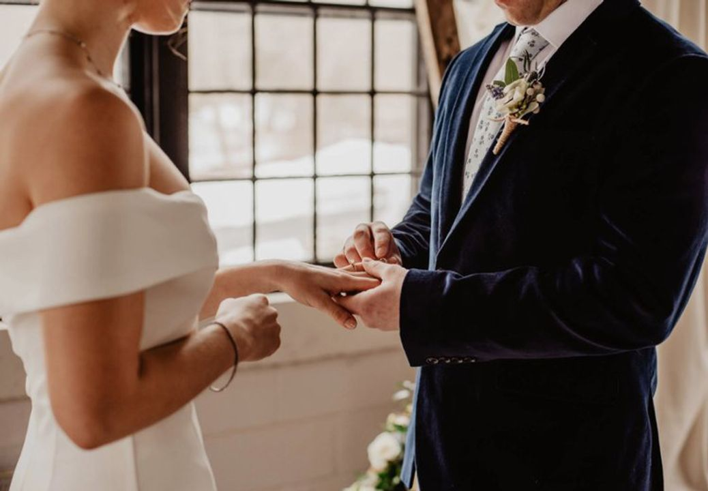

# Chủ nghĩa tiêu thụ

!!! info "Nguồn bài viết"
    [Chủ nghĩa tiêu thụ](https://spiderum.com/bai-dang/Chu-nghia-tieu-thu-C5nZPF0AixN8)

_Dạo gần đây trên News Feed của mình thường xuất hiện những bài viết liên quan đến lối sống "Tang ping" hay "Sam po" tạm dịch: "là lối sống buông bỏ của giới trẻ các nước Châu Á". Và một chủ đề mình cũng thường hay thấy trên spiderum đó là_ [Chủ Nghĩa Khắc Kỷ](https://shop.spiderum.com/blogs/chuyen-nha-nhen/chu-nghia-khac-ky-stoicism)_. Khi đọc những bài viết này, mình thấy chúng có một sự liên kết với nhau rõ rệt, chúng mô tả được đôi phần lối sống của xã hội hiện đại. Ở bài viết này mình sẽ không viết về chủ nghĩa khắc kỷ hay phân tích về những lối sống mới như "Tang ping" hay "Sam po" vì nó được viết khá là nhiều các các bài viết gần đây. Mình muốn tìm hiểu tại sao những lối sống trên lại lên ngôi ở một xã hội tiêu dùng như xã hội hiện nay. Và mình nghĩ chủ nghĩa tiêu dùng chính là một phần nguyên nhân dẫn đến việc này. Vậy chúng ta cùng bắt đầu vào vấn đề chính nào._

## 1. Chủ nghĩa tiêu thụ là gì?

Thuật ngữ “xã hội tiêu dùng” (consumer society) xuất hiện từ sau Thế Chiến Thứ Hai, khi chủ nghĩa tư bản lên ngôi ở các nước Phương Tây. Thuật ngữ này có thể xuất hiện vào sau Thế Chiến Thứ Hai nhưng lối sống này thì đã tồn tại khá lâu trước đây. Nếu lội ngược dòng lịch sử thì sẽ thấy lối sống tiêu thụ, mua sắm, vui chơi, giải trí này thường được giới quý tộc, quan lại, vua chúa qua các giai đoạn đều tôn sùng. Nếu bạn thường xuyên xem phim cung đấu của nước láng giềng thì chắc hẳn cũng thấy rõ cuộc sống xa hoa trong Tử Cấm Thành, nhân vật tiêu biểu mình muốn nhắc đến là Thái Hậu Từ Hy, bà này thì khỏi cần bàn ăn thôi mà phải 100 món khác nhau, 2 bữa ăn nhẹ thì 40 đến 50 món, ít nhất phải bao gồm 20 đĩa thức ăn. Mỗi khi skincare thì 7749 bước, quần áo mặc thì đếm không nổi. Giới nhà giàu bây giờ còn thua xa. Lội thêm tí nữa sẽ thấy ở Ai Cập cổ đại, giới tinh hoa nơi đây tiêu tiền bằng cách xây kim tự tháp và ướp xác chứ họ không đi Babylon để shopping.

Trong quá khứ chỉ có giới nhà giàu mới có thể theo đuổi chủ nghĩa tiêu thụ nhưng ở xã hội hiện đại hầu hết ai cũng có thể ( tất nhiên là không thể tiêu xài như bọn quý tộc cổ đại rồi) nhưng chúng ta có thể đi shopping, ăn uống, vui chơi và giải trí. Và những thứ này, càng ngày càng gắn bó với chúng ta, chúng ta xem việc xài tiền như một nghĩa vụ và không thể thiếu các dịch vụ. Một ví dụ ở xã hội hiện đại như việc phát minh ra điện thoại để chúng ta có thể kết nối với nhau một cách dễ dàng, nhưng ngày nay điện thoại có thể làm gì? Chúng không phục vụ nhu cầu kết nối bạn đầu mà chúng còn phục vụ các nhu cầu khác như chơi game, lướt web,....Chúng ngày một gắn bó, ngày một phổ biến và chúng ta không thể thiếu chúng. Vậy chúng ta là người điều khiển điện thoại hay chính chúng mới là người điều khiển chúng ta?

## 2 Bản chất chủ nghĩa tiêu thụ

Có thể hiểu chủ nghĩa tiêu dùng từ nhiều góc độ. Theo Gabriel and Tim Lang (2006:6-7), có thể hiểu chủ nghĩa tiêu dùng từ 5 chiều kích:

- Thứ nhất,  chủ nghĩa tiêu dùng như là mộ tluận thuyết tinh thần/đạo đức trong các nước phát triển.  Chủ nghĩa tiêu dùng nổi lên – và không hề bị thách thức – như một phương tiện cho tự do, quyền lực và hạnh phúc. Với diễn ngôn này, phong cách, thị hiếu, khát vọng, và tính dục cũng đều bị chi phối.

- Thứ hai, chủ nghĩa tiêu dùng như là ý hệ của vị thế xã hội –với tiêu dùng ganh đua. Không chỉ góp phần xác định thế nào là một  cuộc sống tốt, “consumption” đã làm thay công việc của tôn giáo, và chính trị – như là cơ chế mà qua  đó sự phân biệt vị thế và xã hội được thiết lập; Herbert Marcuse trong cuốnOne Dimensional Man,cho rằng thông qua công nghiệp văn hoá, chủ nghĩa tư bản đã thúc đẩy một ý hệ tiêu dùng (ideology of consumerism). Nó tạo ra và thúc đẩy“false needs”(tạo ra những nhu cầu cho những thứ không thực sự cần thiết), và bằng cách này, nó cũng trở thành cơ chế để kiểm soát xã hội (mechanism of social control).

Thứ ba, chủ nghĩa tiêu dùng như một ý hệ kinh tế trong phát triển toàn cầu (economic ideology). Với sự sụp đổ của khối cộng sản và lối hùng biện về sản phẩm, chủ nghĩa tiêu dùng (với sự theo đuổi các tiêu chuẩn sống cao hơn) được xem như là đã cung cấp một sức mạnh ý hệ để củng cố sự tích luỹ tư bản chủ nghĩa trong hệ thống toàn cầu – vốn đang bị thống trị bởi các tập đoàn xuyên quốc gia.

Thứ tư, chủ nghĩa tiêu dùng  như một ý hệ chính trị (political ideology). Nhà nước hiện đại (modern state) nổi lên như một người đảm bảo quyền của người tiêu dùng và các tiêu chuẩn tối thiểu, là người cung cấp hàng hoá và dịch vụ. Nhà nước đã có thêm vai trò mới, đó là tạo ra thị trường và nguyên tắc thị trường, của cải, trước đây vốn chỉ xem là hàng hoá và dịch vụ công. Như vậy, consumerism đã bước vào địa hạt của chính trị.Thứ năm, chủ nghĩa tiêu dùng là mộtphong trào xã hội tìm kiếm và bảo vệ quyền của người tiêu dùng (consumer movement).

## 3. Người tiêu dùng

> Tôi cực ghét từ Customer First hay ‘Khách hàng là Thượng Đế’! Đó phải là Customer Centric - Khách hàng là trung tâm
>
> Chủ tịch FPT Telecom Hoàng Nam Tiến

Vào thế kỉ XXI, vai trò của người tiêu dùng quan trọng hơn bao giờ hết và là đã trở thành những " Thượng đế" (god-like figure) . Người tiêu dùng là người chọn lựa, là người mua nhưng cũng là người từ chối mua; là người sẽ hào hứng khoác lên mình sản phẩm hay từ chối dùng nó, là người giữ sản phẩm hay cho đi, là người cảm thấy tội lỗi hay nghi ngờ về đạo đức, là người khám phá và diễn giải, đọc và giải mã, là người sẽ yêu thích hay bàng quan với sản phẩm… Họ là người quyết định sản xuất, nuôi dưỡng sự sáng tạo, tạo ra dịch vụ mới trong tiến kinh tế phát triển, động cơ cho chính trị hiện đại, quyền lực để bảo vệ môi trường và tương lai của hành tinh (Gabriel & Lang 2006). Chính vì thế Gabriel và Lang (2006) mới sử dụng từ “unmanageable consumer” (người tiêu dùng không thể bị kiểm soát) để chỉ người tiêu dùng ở thế kỷ XXI. Dó đó, để nắm bắt tâm lý của người tiêu dùng các doanh nghiệp đã tạo ra hàng loạt sản phẩm mà marketing giả trân nhất chưa từng có, là phái nữ mình cũng như các chị em thích ăn nhưng không bao giờ muốn béo thế là Coca cola như thế nào đó đã thần giao cách cảm với chúng ta và một loại thức uống mới ra đời Coke Zero để dành cho chúng ta. Nhưng chúng lại gây cho chúng ta khá nhiều ảnh hưởng xấu và mình chỉ nêu một tác hại đó là uống coke zero gây tiểu đường, yes, bạn không nghe nhầm tiểu đường. Coke Zero là loại đồ uống không đường. Tuy nhiên, các chất thay thế đường mà nó chứa có thể không phải là một lựa chọn đúng đắn cho những người muốn giảm nguy cơ mắc bệnh tiểu đường. Một nghiên cứu kéo dài 14 năm ở 66 118 phụ nữ đã quan sát thấy uống đồ uống có vị ngọt nhân tạo có thể tăng nguy cơ mắc bệnh tiểu đường loại 2.

Nghiên cứu của Brunk đã hệ thống hoá thành một khung phân tích gồm 6 thành tố cảm nhận về đạo đức có thể tác động đến những cảm nhận về đạo đức của một công ty hoặc một nhãn hàng:

1) Người tiêu dùng.
2) Người làm thuê.
3) Môi trường.
4) Kinh tế và cộng đồng địa phương.
5) Cộng đồng doanh nghiệp.
6) Cộng đồng ở nước ngoài.

Kết quả nghiên cứu chỉ ra, ở khía cạnh người tiêu dùng,  một số các hành vi bị coi là phi đạo đức, chẳng hạn: các hoạt động liên quan đến quảng cáo thường dẫn đến câu hỏi về đạo đức (ví dụ như công ty lợi dụng và nhằm vào những người yếu thế và dễ bị tổn thương [như trẻ em, người già, người tàn tật…] để quảng cáo; việc che đậy những chi tiết sản xuất quan trọng; giá cả bị đặt ra ở mức cao; hay việc đặt người tiêu dùng vào thế không được chọn lựa.v.v..) đều dẫn đến cảm nhận tiêu cực về đạo đức của các nhãn hàng.

## 4. Sự liên quan đến lối sống đang nổi liên ở giới trẻ.

Như đã nói ở trên để thúc đẩy nền kinh tế của quốc gia thì người dân trong nước phải góp phần thúc đẩy kinh tế bằng cách tiêu thụ càng nhiều càng tốt, tiêu thụ thì dễ dễ rồi những tiền đâu để tiêu mới khó, để có tiền thì phải làm việc cật lực để đáp ứng nhu cầu mua sắm. Một vòng tuần hoàn như vậy đem lại lợi ích cho quốc gia và nền kinh tế.

Kích thích những nhu cầu không cần thiết của con người để chúng trở thành những nhu cầu cần thiết. Dần dà, không thể thoát khỏi những nhu cầu vô bổ đó, xem nó như là lối sống hạnh phúc "sở hữu càng nhiều càng hạnh phúc" khiến cho người lao động phải làm việc cật lực hơn bao giờ hết để đáp ứng như nhu cầu được xem là cơ bản.

Tại Trung Quốc thị trường hẹn hò nồng nặc mùi chủ nghĩa tiêu thụ hơn bao giờ hết, những mộng tưởng về tình yêu càng nhiều thì càng xoắn vào nhu cầu tài chính bấy nhiêu. Những ứng viên tiềm năng cho các cuộc hẹn hò sắp đặt phải có những giá trị như học vấn, lương bổng, nhà cửa, nghề nghiệp,.. Người bạn đời như một món hàng chỉ cần đáp ứng đủ các tiêu chí mà khách hàng đưa ra bạn sẽ được mua về và sử dụng.

_"Là một học sinh cấp 3 tại siêu đô thị Thâm Quyến, Quinn là một đứa trẻ được hưởng đặc quyền điển hình của tầng lớp giàu có mới nổi của Trung Quốc. Ngoài việc học ở trường, cậu còn tham dự một khóa học được tổ chức bởi một công ty địa phương – thứ hứa hẹn sẽ rèn luyện cho những chàng trai trẻ khả năng điều khiển định mệnh tình ái và đạt được “sự tự do tình ái” – nói tóm lại, một lớp học về cách thu hút phụ nữ. Công ty mà Quinn đăng kí thu phí 7800 NDT (1200 đô la) cho tám tuần học riêng một-một. Chối từ cái nhãn PUA, họ nhấn mạnh việc họ đang truyền cảm hứng cho những người đàn ông trẻ tuổi thể hiện giá trị và giành lấy trái tim của những “nữ thần” họ khao khát. Một số học sinh là con nhà giàu có như Quinn, nhưng phần lớn là những thanh niên trong độ tuổi hai mươi phải làm việc cật lực để có mức sống tạm ổn ở Thâm Quyến. Những khách hàng này thường kiếm khoảng 10000 NDT một tháng, đủ để họ đi học lớp hạng trung, nhưng không đủ để mua nhà ở thị trường sốt đất như Thâm Quyến – và còn cách rất xa giấc mơ tự do tài chính trọn đời. Khóa học yêu cầu học sinh đăng kí những app hẹn hò và mạng xã hội để rèn kĩ năng: mỗi tuần, họ phải nói chuyện và mời ra ngoài 7 đến 10 phụ nữ. Điều quan trọng nhất của những kĩ năng này là những gì mà người huấn luyện và học viên tự hạ mình gọi là “bi ge”. Từ đồng nghĩa trong tiếng Anh là “big”, phần dịch nghĩa đen của thuật ngữ khó để viết ở đây, nhưng nó nói tới khả năng thể hiện bản thân như một người đàn ông giàu có và có đẳng cấp, bất kể vị trí xã hội thực sự của người đó là gì. Điều này yêu cầu việc chọn lọc kĩ lưỡng những gì thể hiện trên profile mạng xã hội, phong cách, sở thích cá nhân, và cơ thể."( theo_ tờ Sixth Tone, _Thân Trang dịch)_

Người trẻ đang rất mệt mỏi và kiệt quệ với những áp lực mà xã hội tiêu thụ đưa ra học tập, làm việc, kiếm nhiều tiền thật nhiều để tiêu thụ thật nhiều và điều đó làm tăng giá trị của bản thân. " Tức nước thì vỡ bờ" không chịu được nữa thì buông xuôi và là lối sống mới mà những người trẻ ở người quốc gia đi đầu trong nền kinh tế thị trường ở Châu Á chọn.

_"Tôi sẽ không kết hôn, mua nhà hay sinh con. Cũng chẳng mua túi xách, đồng hồ,..." . "Tôi sẽ lười biếng chỗ làm việc. Tôi sẽ là một lưỡi kiếm cùn để tẩy chay chủ nghĩa tiêu dùng." "Trong một xã hội, nếu thấy hy vọng từ chuyện làm việc chăm chỉ có thể mua được nhà, bạn sẽ làm việc. Nhưng khi hy vọng chẳng thấy đâu, thì bạn sẽ muốn buông xuôi." “Không phải vì tôi là một người nhút nhát, tôi chỉ không có đủ tiền để cảm thấy tự tin,” “Khi một người đàn ông có tiền, mọi phụ nữ đều cảm thấy anh ta là định mệnh của cô ấy.”_
