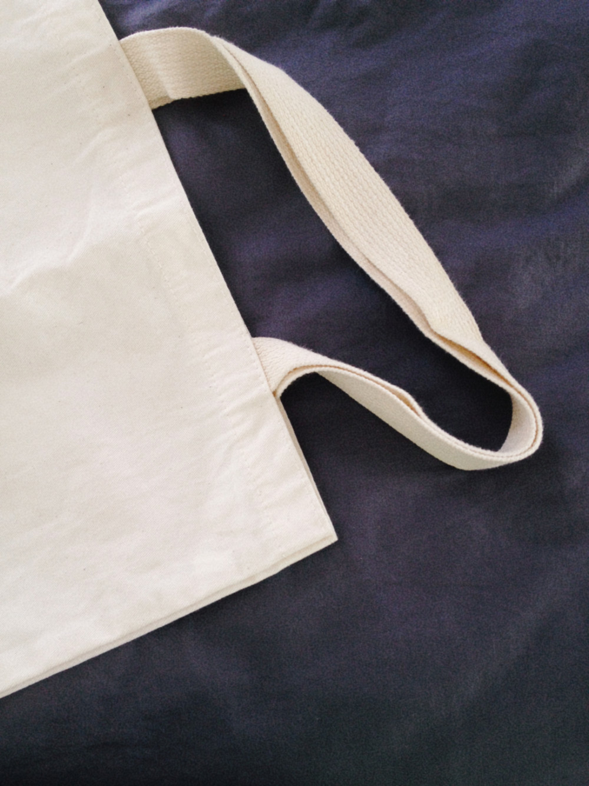

# Lối sống không rác thải

!!! info "Nguồn bài viết"
    [Lối sống Zero Waste cho người mới bắt đầu - Tee Wanders](https://spiderum.com/bai-dang/Loi-song-Zero-Waste-cho-nguoi-moi-bat-dau-hm3)

Tôi bắt đầu thực tập lối sống Zero Waste (mà tôi nghĩ, nó nên là Low Waste thì đúng hơn) cách đây cũng không lâu lắm, và tất nhiên tôi chẳng hề nghĩ mình đang sống một cuộc sống hoàn toàn không thải ra chút rác nào. Nhưng dù sao Zero Waste hay Low Waste cũng là một lối sống đáng để sống, và tôi thì vẫn cần thêm thời gian để thực sự quen với nó. Đừng nghĩ tôi là một người sống đúng chuẩn Zero Waste (Green Living) hay Minimalist. Tee Wanders chỉ là nơi tôi chia sẻ những trải nghiệm và câu chuyện của riêng mình (và đôi lúc là câu chuyện của người khác). Hành trình đến với hai lối sống trên còn dài, còn cần tôi cố gắng nhiều hơn nữa. Thế nên tôi cũng chỉ là một kẻ chập chững mà thôi. Tôi tìm hiểu, nghiên cứu và thực hành rồi viết lên đây để chúng ta, bạn và tôi cùng học, cùng trải nghiệm.

Còn dưới đây là một vài điều nho nhỏ mà tôi đã áp dụng khi mới đầu đến với lối sống Zero Waste, có thể sẽ hữu ích cho bạn phần nào.

## Zero Waste là gì?

Zero Waste là ý tưởng về một **lối sống không hoặc tạo ra rất ít rác thải,** bằng việc **sử dụng các vật dụng bền vững, thân thiện với môi trường,** kết hợp với **tái chế và ủ phân vi sinh** để xử lý rác hữu cơ. Bên cạnh Zero Waste thì **Plastic Free** cũng là một lối sống bền vững nhưng tập trung chủ yếu vào việc giảm thiểu nhu cầu sử dụng nhựa nhằm tránh các tác động xấu của nhựa đối với bản thân và môi trường.

Hiện nay, Zero Waste ngày càng trở nên phổ biến khi con người dần dần ý thức được hậu quả mà những thói quen sinh hoạt thường ngày của mình gây ra. Tôi được biết đến lối sống này khi tình cờ xem bài thuyết trình của chị Lauren Singer trên Ted Talks. Cũng kể từ lúc đấy, tôi bắt đầu tìm hiểu thêm về lối sống này, tôi theo dõi nhiều blog, xem video, phim tài liệu và đọc sách về những chủ đề liên quan đến Zero Waste cũng như môi trường. Sau này khi đi làm, tôi may mắn quen hai người chị cũng đang sống lối sống thuần tự nhiên và bền vững, nên thành ra lại có thêm động lực để hiện thực hóa lối sống Zero Waste mà mình vẫn hằng hướng đến. Càng tìm tòi, khám phá, tôi càng thấy khá ngạc nhiên vì hóa ra Zero Waste không còn là một khái niệm xa lạ gì với nhiều người ở Việt Nam (như tôi vẫn nghĩ). Có nhiều cộng đồng Zero Waste ở các vùng khác nhau, nhiều cửa hàng bán các sản phẩm phục vụ cho lối sống này, nhiều blogger và cả không ít người nổi tiếng đang thực tập sống không rác thải và chia sẻ kinh nghiệm, hiểu biết với những người xung quanh. Lắm lúc thấy mình bắt đầu muộn quá. Nhưng dù sao thì, muộn vẫn còn hơn không.

<iframe title="Why I live a zero waste life" width="1080" height="608" src="https://www.youtube.com/embed/pF72px2R3Hg?feature=oembed" frameborder="0" allow="accelerometer; autoplay; encrypted-media; gyroscope; picture-in-picture" allowfullscreen="" data-ruffle-polyfilled=""></iframe>

## **Năm nguyên tắc cơ bản của Zero Waste (5R)**

Trong cuốn sách [Zero Waste Home](https://zerowastehome.com/), Bea Johnson có chia sẻ năm nguyên tắc cơ bản mà những người đang hướng tới lối sống này cần áp dụng – Nguyên tắc 5R:

**Refuse what you don’t need:** Từ chối cái bạn không cần. Chúng có thể là túi ni lông, ống hút nhựa, tờ rơi hay thư rác…

**Reduce what you do use:** Cắt giảm những thứ không cần thiết mà bạn vẫn đang sử dụng, như nước xả vải chẳng hạn.
    
**Reuse whatever you can:** Tái sử dụng nhiều lần bất cứ thứ gì bạn có thể. Chẳng hạn như thay vì vứt chúng đi, bạn có thể sửa/ gắn lại và dùng tiếp nhằm kéo dài tuổi thọ cho những vật dụng đó.

**Recycle what you can’t refuse or reduce:** Tái chế những vật dụng bỏ đi, những vật không cần thiết thành những vật có ích.

**Rot what’s left over:** Biến rác thải hữu cơ thành phân hữu cơ, nuôi cây xanh, nuôi đất tốt.

## Bạn nên bắt đầu lối sống Zero Waste như thế nào?

### Xác định rõ tại sao bạn muốn thực tập lối sống này

Mọi hành động, mọi sự lựa chọn đều cần có một lý do. Bạn chọn lối sống không rác thải, vậy lý do là gì? Bạn muốn góp phần bảo vệ môi trường, muốn cắt giảm chi phí tiêu thụ, muốn tránh xa những chất độc hại từ nhựa, từ túi ni lon? Hay đơn giản là bạn ưa cuộc sống gọn gàng, và thấy khó chịu khi trong nhà có quá nhiều những thứ lỉnh kỉnh, không cần thiết, còn ngoài bãi biển thì chai nhựa, túi, hộp lại bị vứt lung tung?

Bạn cần xác định rõ câu trả lời của mình, bởi lẽ nó chính là động lực để thôi thúc bạn luôn cố gắng, là cái đích để bạn luôn hướng về mỗi lúc thấy nản chí, chênh vênh.

### Nhìn lại xem lượng rác thải hằng ngày của bạn bắt nguồn từ đâu

Sau khi bạn xác định rõ mục đích đến với lối sống Zero Waste rồi, giờ là lúc bạn nhìn lại và xem xét xem rác thải của bạn thường bắt nguồn từ đâu. Việc này sẽ giúp bạn có một cái nhìn tổng quát về lượng rác mình thường thải ra và nguồn gốc của chúng, để từ đó biết được mình nên tập trung ở đâu trước hết. Với một số người, rác chủ yếu đến từ thức ăn dư thừa, vậy để cắt giảm rác, vấn đề đầu tiên họ cần cân nhắc là nấu vừa đủ ăn, thay vì nấu quá nhiều, dẫn đến thừa thãi, hoặc tìm hiểu cách ủ phân sinh học từ thức ăn thừa. Với một số người khác, rác lại bắt nguồn từ việc uống quá nhiều những cốc cafe, trà sữa takeaway mỗi ngày. Để giảm thiểu rác, trước hết họ cần hạn chế uống những đồ uống takeaway hoặc mang theo cốc (tái sử dụng) của mình để đựng nước uống…

Nếu bạn đã “lỡ” thải ra quá nhiều chai nhựa rồi, thì hoặc là tìm cách biến chúng thành một món đồ hữu ích trong nhà, hoặc là tự tạo eco-brick hay gửi chúng đến những nơi tái chế đồ nhựa.

### Bắt đầu từ việc cắt giảm những vật dụng dùng một lần

Nếu quan sát kỹ, bạn sẽ thấy hằng ngày chúng ta sử dụng rất nhiều các sản phẩm dùng một lần như khăn giấy, khăn ướt, cốc giấy, ống hút nhựa, hộp cơm bằng xốp, thìa dĩa nhựa, túi ni lon…

Chính những sản phẩm này, dù có vẻ được nhiều người ưa dùng vì tính thuận tiện và nhanh gọn, lại tiêu tốn rất nhiều tài nguyên khi sản xuất ra. Hơn nữa, vì vốn dĩ là đồ dùng một lần nên ngay sau khi sử dụng xong chúng lại trở thành rác. Còn chưa kể đến tính độc hại mà những thành phần hóa chất có trong các đồ dùng giấy, nhựa đó gây ra.

_Để cắt giảm việc sử dụng chúng, bạn có thể bắt đầu bằng các hành động như:_

- **Luôn mang theo bình đựng nước khi đi ra ngoài.** Bình nước tôi đang mang theo bên mình là bình inox giữ nhiệt rất tốt. Tôi là kẻ nghiện trà nên việc dùng bình giữ nhiệt sẽ là một sự lựa chọn tuyệt vời. Chỉ cần bỏ một nhúm lá bạc hà, cỏ ngọt hay hoa cúc vào bình là đã có ngay một bình trà ấm nóng cho cả một buổi lang thang ngoài trời.
- **Hạn chế uống các thức uống takeaway** hoặc nếu có uống thì hãy nhớ mang theo lọ hoặc cốc thủy tinh để mua.
- **Mang theo ống hút (bằng tre, thủy tinh hoặc inox)** khi đi uống cafe, hay trà sữa. Mà tốt hơn hết là không cần dùng ống hút chi cho mệt. Hiện tại, đang đi lang thang, tôi có mang theo một đôi đũa tre, một thìa tre, một dĩa tre và không hề mang theo ống hút. Lúc uống, thì cứ vậy mà uống thôi, ống hút thực chất cũng đâu có cần thiết. Đến quán cafe hay trà sữa, bạn chỉ cần bảo với nhân viên “mình không dùng ống hút nhé”, vậy là được rồi.
- **Mang theo túi vải khi đi chợ, siêu thị hay đi mua sắm.** Túi vải bạn cũng có thể tự làm từ chiếc áo phông cũ của mình. 
- **Dùng khăn tay vải thay cho khăn ướt, khăn giấy.** Tôi thường mang theo bên mình một chiếc khăn tay (được may từ chiếc áo sơ mi đã rách) để lau lúc ăn, rửa tay hoặc lau mồ hôi, vậy là sẽ không còn cần dùng khăn giấy nữa.
- **Nếu buộc phải sử dụng đồ dùng một lần thì hãy chọn những sản phẩm được làm từ chất liệu sinh học, thân thiện với môi trường** và có thể phân hủy an toàn. Hiện nay một số nơi đã bắt đầu bán các cốc, bát, đĩa, và hộp dùng một lần (có thể vài ba lần) từ bã mía, và bột sắn. Bạn có thể tìm hiểu thêm. Tôi có thấy bên [Tre Shop](https://www.facebook.com/Hangtieudungtutre/) và [Sạp Hàng Chàng Sen](https://www.facebook.com/saphangChangSen/) cũng đang bán loại sản phẩm này. 

