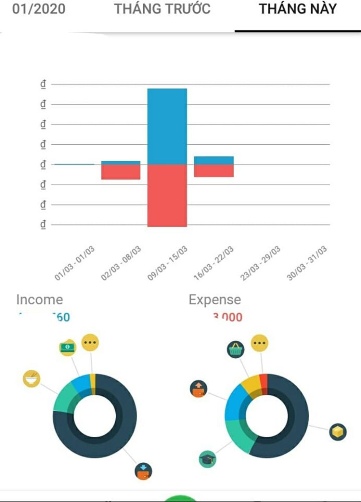

# Quản lý chi tiêu

!!! info "Nguồn bài viết"
    [Đỗ nghèo khỉ & Quản lý tài chính cá nhân](https://spiderum.com/bai-dang/Do-ngheo-khi-and-Quan-ly-tai-chinh-ca-nhan-mlc)

Nhân dịp dịch mọi người ở nhà rảnh rỗi thì mình vẫn lao ra đường đi làm sml, mãi mới có hôm nay được nghỉ. Mình muốn tiếp tục phân tích truyện với review phim cơ mà đi làm nhiều quá bị đứt mạch cảm xúc nên bây giờ mình sẽ viết một bài chia sẻ kinh nghiệm sống.

## Giới thiệu 

Với một người tầm tuổi sinh viên (viết vậy vì mình không đi học), mình tự nhận thấy có rất nhiều kỹ năng sống mà mình cần phải học. Mình xin được liệt kê những kỹ năng mình thấy thực tế và thiết thực:

- Biết kỹ năng cứng và kỹ năng mềm là những khái niệm chung chung vô dụng, dễ gây hiểu lầm, dễ được đem đi lừa đảo

- Quản lý thời gian biểu

- Quản lý tài chính cá nhân

- Sắp xếp không gian làm việc và không gian sống

- Xử lý một số tình huống trong cuộc sống

- Làm việc một mình và làm việc nhóm

Và nhiều nữa mà hiện tại mình chưa nghĩ ra. Bài viết này mình sẽ chia sẻ về câu chuyện quản lý tài chính cá nhân. Vì là kinh nghiệm cá nhân nên nếu bạn có ý kiến đóng góp hay tip tài chính nào hay hãy cứ chia sẻ, vì mình cũng đang học hỏi. Cám ơn bạn <3 Giờ bắt đầu nhé!

## Quản lý tài chính cá nhân? Cái gì vậy?

Lớn rồi, đi làm rồi hoặc bạn vẫn ăn bám gia đình thì giờ bố mẹ cũng chỉ chu cấp cho 1 khoản nhất định, bạn tự tính toán tiêu xài. Ồ, không lo, trước giờ bố mẹ vẫn cho mình tiền ăn sáng nên cái này easy game.

Không bạn ơi, sai lầm!

Với một số tiền nhất định, bạn phải tự quyết: tiền học, tiền trọ, tiền xăng xe, tiền để dành mua điện thoại, tiền ăn tiêu, mua sắm, vừa mua cái áo mà h nó sale 30% tiếc quá đi, mình mua bó rau 10k thì có là bị đắt k nhỉ, đi nhậu về muộn bị bắt chốt đen quá, h hết cả tiền mà tận 2 tuần nữa mới có lương thì h sống thế nào đây,... Tức là bạn bây giờ đã khác với bạn của ngày xưa ấy: bé bỏng, được cho 20k ăn sáng mỗi ngày, chỉ phải tự quyết định 20k dùng để mua món gì ăn vừa ngon vừa no hay nhịn để mua đồ chơi, bàn chải đánh răng, muối, giấy vệ sinh, tiền điện, tiền nước,... đều có bố mẹ lo. Giờ chúng mình sẽ cùng làm quen với một khái niệm mới xịn xò, trách nhiệm và cũng đáng sợ: **Tự chủ tài chính - tiền bạn, bạn tiêu.** Mình nghĩ sinh viên ai cũng sẽ có lần vung tay quá trán, nợ nần, nhịn đói nhịn khát dành tiền mua đồ, đi làm vất vả nhưng vẫn là không đủ,... Để giải quyết những vấn đề này, mình sẽ chia sẻ các bạn skill **Quản lý tài chính cả nhân - có tiền rồi, giờ dùng ntn?**

## Thu - Chi, Tiết kiệm, Dòng tiền,... Wuttt ?

Đầu tiên, hãy chuẩn bị tâm lý là chuyện tiền nong sẽ lằng nhằng và phức tạp, không phải ngồi một lúc hay ngày một ngày hai đã thấm nhuần tư tưởng ngay được. **ĐỪNG NẢN**, mình ở đây để giúp bạn mà. Tuy là kinh nghiệm cá nhân nhưng mình sẽ cố gắng giải thích dễ hiểu nhất có thể.

Quản lý tài chính cá nhân gồm các skill:

- Biết đọc dòng tiền: phân biệt tiền ra, tiền vào

- Thói quen ghi chép, theo dõi chi tiêu

- Thống kê, đọc tổng báo cáo & lên kế hoạch chi tiêu hợp lý

## Đâu là tiền ra, đâu là tiền vào? 

### Tiền thu + Tiền Chi = Số dư

#### 1. Tiền thu (Income) 

_Là số tiền bạn nhận được từ nguồn bên ngoài_

- Lương (tập thói quen giữ bảng lương nhé)
- Tiền được tặng: gia đình chu cấp, người thân quen cho, tặng,...
- Tiền người khác trả nợ bạn
- Lãi của gửi tiền ngân hàng

#### 2. Tiền chi (Expense):

_Số tiền bạn mất đi_

Không kể mục đích gì, cứ tiền bạn cho đi là tiền chi. Có nhiều kiểu phân chia các khoản chi, còn mình chia như sau:

- Chi phí cố định (trả hàng tháng): tiền học, tiền điện, tiền nước, tiền ăn,...

- Chi phí sinh hoạt: những mục tiêu pha, mua sắm trong ngày

- Khác: tiền bạn cho người khác vay, thuế,...

#### 3. Số dư: Số tiền hiện đang có 

- Tiền thật trong ví
- Số thật trong tài khoản
- Tiền tiết kiệm gửi ngân hàng

> Bài luyện tập nho nhỏ:
>
> Bạn có 50k trong ví, bạn ăn sáng với lũ bạn hết 35k/bát nhưng mang không đủ tiền nên vay bạn thân 15k, nó bảo bạn bao nó lần tiếp, k phải trả. Bạn đi làm 15k/h, 6 tiếng, được cty phụ cấp 10k gửi xe, có đồng nghiệp vay 10k hứa mai trả. Trên đường về bạn mua cho mẹ 2 gói bột canh 4k và không lấy tiền vì lớn rồi ai lại đi lấy tiền của bố mẹ bao h. Thu chi của ngày hôm nay ntn?

Để theo dõi số tiền này hiện đang ở đâu, như thế nào, bạn sẽ cần trợ giúp.

## Công cụ hỗ trợ đắc lực

### 1. App quản lý tài chính:

Mình có mua sổ chi tiêu nhưng quá lười để viết tay, nên cách hiệu quả hơn là tải app, dùng đt để quản lý. App mình đang dùng là **Money Lover**. Mình xóa rồi lại tải mấy lần vì ban đầu tải về dùng không hiểu. Không phải vì app khó hiểu mà vì mình không biết đọc tiền :') App có nhiều chức năng hay lắm nhưng để đơn giản nhất, mình chỉ tạo 2 ví: tiền mặt và tài khoản ngân hàng. Money Lover có thể kiên kết với tài khoản ngân hàng và cập nhật sao kê tự động (tức là tiền ra tiền vào trong tk của bạn nó tự cập nhật, bạn không phải lo). Ví tiền mặt để theo dõi số tiền mặt bạn hiện đang cầm trong tay, chỉ cần khai báo đủ trong ngày bạn chi bao nhiêu cho việc gì, còn lại tính toán app sẽ lo hết. Chi tiết về app bạn nên lên trang web để biết thêm thông tin.

Phần khó nhất của việc dùng app này là lập thói quen báo cáo chi tiêu hàng ngày. Tức là vừa tiêu tiền xong thì nhập ngay vào app. Lúc đầu chưa quen còn quên quên nhớ nhớ thì bạn nên đếm tiền và check số với app thường xuyên. Tránh tình trạng lệch số, không nhớ được khoản thu-chi, việc theo dõi sẽ không còn hiệu quả.

### 2. Tài khoản ngân hàng:

Chào mừng tới đại học, chào mừng tới tài khoản ngân hàng. Ban đầu mình nghe tới ngân hàng, mình sợ lắm, vì trước đó xem thời sự hay nghe người lớn nói chuyện về ngân hàng toàn ba cái thứ gì gì mà lãi suất với chả tiết kiệm, tài khoản, ATM các kiểu nói chung là mình không hiểu cái mô tê gì cả. Ngay từ hôm nhập học, trường đh đã bắt mình lập luôn 1 tài khoản BIDV để tiện cho trường thu tiền học. Vào trong năm thì có nhiều ngân hàng đến quảng cáo mở tài khoản được tặng tiền. Nên hay không nên tham gia? Kinh nghiệm của mình là:

### Tìm hiểu, luôn luôn tìm hiểu

Nói nhanh cho nó vuông: mình không thích BIDV của trường :)) Mình hiện đang dùng Timo. Tiêu chí của một ngân hàng mình chọn mở tài khoản gồm:

- Có internet banking (tức chuyển tiền online)
- Phí dịch vụ hàng tháng thấp (phí duy trì tài khoản, phí chuyển khoản, phí tin nhắn giao dịch,...)
- Độ phủ sóng cao (gửi tiền liên ngân hàng được, nhiều trụ sở quanh thành phố)
- Quan trọng: dễ sử dụng  (dễ đăng ký, điều khoản dễ hiểu, dễ kiểm soát dòng tiền,..)
- Nhân viên tốt :))

Hôm nhập học có 1 bàn của ngân hàng yêu cầu sinh viên bắt buộc điền thông tin đăng ký mở tài khoản. **Các bạn ạ, nếu các bạn không thích, không ai bắt các bạn mở tài khoản ngân hàng được hết**. Mình cũng như hàng nghìn sv khác, tưởng đó là một bàn thông tin bắt buộc nên đăng ký. Xin thưa, xuôi theo đám đông và đặt bút ký một văn bản mình không hiểu rõ là một việc cực kỳ nguy hiểm.

Về BIDV, mình muốn dùng internet banking thì phải ra ngân hàng đăng ký giấy tờ thêm một lần nữa. Kinh nghiệm cuộc sống: Tới ngân hàng làm việc và đi rút tiền ở cây là việc vô cùng tốn thời gian và mệt mỏi. Thường khi bắt buộc phải tới ngân hàng làm thủ tục thì mình sẽ dành hẳn ra một ngày, tới đúng giờ hành chính, chuẩn bị đầy đủ giấy tờ, tiền nong và thắp hương khấn các cụ phù hộ vì bạn thân mến ơi nó lâuuuuuuuuuuuuuu dã man ý. Có một lần mình cần nộp tiền hay chuyển tiền gì đó và tới trụ sở BIDV cạnh trường, nhưng nhân viên không tiếp (sv mà) và yêu cầu mình ra ATM mà làm :) Bye BIDV. Dù không có nhiều kỷ niệm đẹp với BIDV, nhưng BIDV khá là phổ biến với sinh viên, thế nên nếu bạn có ý định mở tk thì vẫn là nên tìm hiểu trước (đặc biệt là tìm trụ sở ít vắng người, dịch vụ có thể sẽ tốt hơn).

Một ngân hàng nữa mình từng có cơ hội tiếp xúc là Vietcombank. Người người dùng VCB, nhà nhà dùng VCB. Vì đông người dùng nên cũng rất đông người tới ngân hàng chuyển tiền và ra cây rút tiền. Đi nộp tiền ở VCB là nỗi ám ảnh của mình: người nườm nượp, đông như đi hội. VCB có inetnet banking khá tiện, khá phê, nhưng phí dịch vụ lại nhiều, huhu. Các bạn có thể tìm bảng giá phí dịch vụ của VCB xem để biết thêm chi tiết. VCB thì phổ biến với giới doanh nhân, những người đi làm và có nhìu tìn.

Một số ngân hàng mình biết qua qua, mong các bạn bổ sung thông tin. ACB dịch vụ tốt, ngân hàng của người có nhìu tìn đều đặn hàng tháng và lý tưởng để mở thanh toán quốc tế. MSB dịch vụ cũng tốt, đăng ký nhanh, nhưng độ phủ sóng chưa cao :')

Cuối cùng, Timo. Timo là ngân hàng số, tức là không có trụ sở ngân hàng offline. Timo có thể hiểu nôm na là một nhánh của VP Bank. Thông tin các bạn có thể tìm hiểu tại trang web của Timo. Vì là ngân hàng số nên chắc chắn Timo có chuyển tiền online, và Timo chuyển tiền thì hơn cả tốc độ bàn thờ, gửi cùng ngân hàng hay khác ngân hàng đều nhận được ngay lập tức (thường gửi tiền khác ngân hàng thì ngày hôm sau tk kia mới nhận được). App siêu dễ sử dụng, dịch vụ đăng ký online (tài khoản tiết kiệm,...) cực dễ, cực nhanh, rút tiền ở cây nào cũng được. Và trên hết là,_Timo không mất phí đăng ký hay phí dịch vụ gì hết_. Có một điểm trừ, mà mình nghĩ nếu Timo khắc phục được thì con đường đưa VN thành nước thanh toán online 100%, không dùng tiền mặt là dễ dàng: Timo chưa liên kết với các app, ví thanh toán điện tử (Momo, Viettel pay,...) khác.

Còn về các ngân hàng, dịch vụ tới trường đh quảng cáo là mở tài khoản được tặng tiền, mình chỉ có thể khuyên các bạn nên tìm hiểu thật kỹ, đừng nghe tặng tiền, doanh nghiệp nước ngoài mà ham. Mình không nói được nhiều vì hiện loại hình này vẫn còn gây tranh cãi, có người bảo nó bình thường, thủ tục lằng nhằng tí, có người bảo lừa đảo, thực hư thì cũng chưa rõ thế nào. Theo mình biết thì bạn sẽ phải nộp vào tài khoản và duy trì một số tiền nhất định trong tài khoản này thì mới được tặng tiền, hoặc đáp ứng một số yêu cầu nào đó (mà thường là mọi người không thích). Khó quá thì bỏ qua, tiền là của bạn, cứ chọn cái gì dễ, tiện mà dùng.

Đi liền với tài khoản là thẻ ngân hàng. Thẻ mà chúng mình đăng ký tài khoản và được ngân hàng phát (thực ra là mình có đăng ký làm thẻ ấy nhưng mình nói giản lược cho dễ hiểu) là **THẺ GHI NỢ_DEBIT CARD, trong tài khoản có bao nhiêu tiền thì tiêu bấy nhiêu**. Thẻ tín dụng là cái khác, và đỗ nghèo khỉ như mình thì chưa dùng nên mình sẽ im lặng. Mình sẽ không nói về rút tiền tại ATM và dùng thẻ, vì mình k sử dụng 2 cái này nhiều. Bạn nào có kinh nghiệm thì chia sẻ nhé.

Khi đã biết đọc tiền, có công cụ hỗ trợ theo dõi thu - chi, thì tiếp theo là

## Lập kế hoạch chi - tiêu hợp lý

### Bước 1: Đọc thống kê

Cái này Money Lover có xịn luôn.

_Báo cáo thu chi xịn xò của Money Lover_

Biểu đồ cột: thể hiện số tiền thu (màu xanh) và chi (màu đỏ) tổng theo từng ngày

Biểu đồ tròn: Thể hiện thu chi theo từng hạng mục

- Biểu đồ tròn bên trái Income thể hiện số tiền mình thu trong tháng: màu xanh dương đậm chiếm tỉ lệ vòng tròn nhiều nhất là lương, sau đó là các mục khác nhỏ hơn.
- Biểu đồ tròn bên phải Expense thể hiện số tiền mình chi trong tháng: màu xanh dương chiếm tỉ lệ lớn nhất là tiền tiết kiệm, xanh lá là mua sách,...

Bấm vào từng biểu đồ trong sẽ cho bạn biết thông tin cụ thể từng hạng mục bạn chi tiêu chiếm bao nhiêu phần trăm, con số cụ thể là bao nhiêu

### Bước 2: Lên kế hoạch dùng tiền

Mỗi cây mỗi hoa, mỗi nhà mỗi cảnh, **tiền bạn - bạn tiêu.** Mình sẽ không bảo bạn phải chi tiêu thế nào, mục này mình sẽ trả lời 1 số câu hỏi mình hay gặp khi tâm sự quản lý tiền cá nhân với hội bạn:

**_Tao có tí tiền thì quản lý cái gì?_**

Mục đích của quản lý chi tiêu không chỉ để biết "Ơ tiền mình bỗng dưng biến đâu mất" mà còn từ đó điều chỉnh thói quen để không bị vung tay quá trán và lên kế hoạch để tiết kiệm gia tăng tài chính (tức là có ý thức kiếm nhiều tiền hơn). Khi số tiền thực tế đập vào mặt , tự bản thân sẽ có ý thức suy ngẫm trước khi làm, thúc đẩy ý thức tìm giải pháp những vấn đề tiềm ẩn. Tiền điện tháng này cao hơn tháng trước ~> Dậy sớm làm việc vào ban ngày, dùng ánh sáng mặt trời thay vì bật điện cả đêm.

**_Ngân hàng, tài khoản, tiết kiệm,... nghe mệt mỏi nên không làm?_**

Ngân hàng thì mệt mỏi thật, như mình đã kể ở trên. Như là bảo hiểm y tế, không thích thì vẫn nên làm. Đến tuổi này rồi, nhu cầu mua sắm của chúng mình tăng cao, sale và deal hời thì đa số là shop online + sự lười đi ra ngoài để mua sắm thì thanh toán online là hợp lý. Không phải rắc rối khi shipcod, shipper không có đủ tiền lẻ trả lại, có thể mua sắm từ xa,...

Về tktk, mình khuyên các bạn nên tìm hiểu và gửi tiết kiệm nếu có điều kiện. Thường mọi người khuyên nên gửi tiết kiệm vì có tiền lãi, thực ra số tiền lãi này chẳng đáng là bao. Mình gửi tiết kiệm để ngăn bản thân tiêu xài phung phí (sau 1 kỳ hạn thì mới được rút tiền) và dùng số tiền này để phòng hờ những trường hợp thật bất ngờ của cuộc sống: tai nạn, ốm đau,... Tiền bạn - bạn tiêu, đời bạn - bạn sống, ha? Với cả mất công tải app đọc báo, đi bộ tặng tiền làm gì để bị lừa đảo, trong khi có thể sống bt, không mất công sức mà hàng tháng vẫn có thêm 1 vài xu bỏ túi :')

### Bước 3: Ý chí, Quyết tâm, Quyết thắng

Bạn có thể bắt đầu đọc sách từ ngày mai, dậy sớm từ tuần sau,... nhưng ngưng tiêu tiền phung phí thì nên bắt đầu ngay bây giờ. **Giở ví ra mà đếm xem hiện mình thực sự có bao nhiêu tiền đi.** Xin nhắc lại những thói quen cần tập:

- Giữ bảng lương, hóa đơn, chứng từ
- Ghi chép theo dõi thu chi, đếm tiền hàng ngày
- Tìm hiểu thông tin kỹ càng trước khi quyết định ký bất cứ văn bản nào, đặc biệt liên quan đến tiền nong thì kỹ x3
- Lên kế hoạch chi tiêu và không vỡ kế hoạch cái thai này là của ai
- Tỉnh táo trước những cám dỗ cuộc sống

## Cám dỗ tài chính

Đặt tên cho sang mồm, phần này mình sẽ nói qua về một số phương thức thanh toán mình biết:

- Thanh toán tiền mặt: tiền trao cháo múc
- Thanh toán chuyển khoản: internet banking là chân lý và có thể mất phí
- Cọc và trả sau: Bạn thanh toán trước 1 phần giá sản phẩm, khi nhận hàng thanh toán nốt phần còn lại. Hình thức này thường diễn ra khi bạn đặt một món hàng không có sẵn và sau 1 thời gian mới nhận được sản phẩm. Mặt bằng chung hiện nay thường là cọc 50% giá trị món hàng trở lên và chưa kể phụ phí. Nếu lỗi xuất phát từ phía sản xuất/cung cấp dịch vụ, bạn sẽ được hoàn lại cọc. Lỗi đến từ phía bạn (đặt xong không lấy) thì bạn mất cọc. Hiện tại xuất hiện tình trạng bùng hàng khá nhiều, nên trước khi bạn cọc tiền mua sản phẩm/dịch vụ thì nên có giao kèo kỹ (hợp đồng, tin nhắn, bằng chứng,..) tránh tình trạng lừa đảo
- Trả góp: Hình thức ngày diễn ra khi bạn thanh toán 1 sản phẩm/dịch vụ lâu dài và số tiền khá lớn như mua điện thoại, mua xe, niềng răng,... Từ đầu tới hạn sẽ trả dần 1 phần giá tiền cho đến hết thì thôi. Thường trả góp sẽ có lãi suất theo kỳ hạn, khi trả theo hình thức này nên có giấy tờ minh bạch đảm bảo.

### Shopee, Tiki,... Tip mua sắm của mình

- Check giá sản phẩm trên mạng trước, tới mua hàng sau.
- Tìm sản phẩm bạn cần mua trên google, nếu vẫn đang cân nhắc thì đừng vội mua ngay, đợi 1-2 ngày sau google chạy quảng cáo 1 đống sản phẩm tương tự ở mọi trang web bạn vào :') rồi, giờ chọn chỗ tốt nhất mà mua
- Niệm chú: Mình có thực sự cần cái này không? Save ảnh, lưu link, 1 thời gian sau (tầm 1 tuần, có thể hơn), bạn vẫn thấy sản phẩm này cần mua thì hẵng mua (Đa số chiêu trò marketing khiến chúng mình cứ thấy cái gì cũng phải mua ngay)
- Tham gia các nhóm mua sắm của sv hoặc thành viên tầm tuổi sv: hàng second hand nhiều và rẻ, hoặc đồ mới mà bán lại rẻ (bạn biết mà nhiều người vung tay quá trán lắm)
- Note lại các đợt giảm giá trong năm của các hãng

## Kết lại

Tiền bạn - bạn tiêu, cơ mà lớn rùi, kiếm ra tiền thì cũng tiết kiệm chút đem về khoe ba má chứ đừng xài hết nhé. Yêu thương <3

> Đáp án bài tập: Thu: 15x6+10= 100k. Chi: 20+10+8= 38k. Số dư thực tế: 50-38+100= 112k (đã gồm 1 món ân tình 15k chưa trả).
