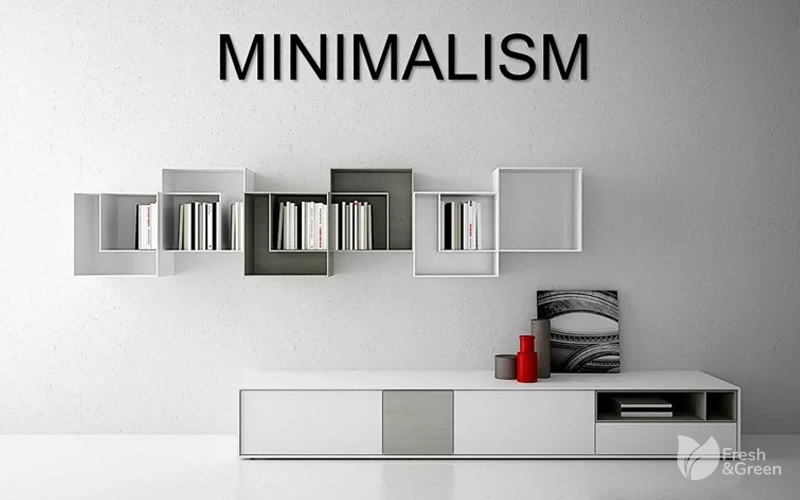
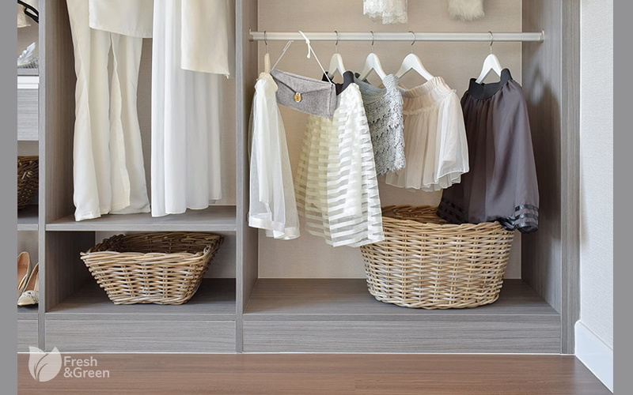

# Tối giản đồ dùng

!!! info "Bài viết gốc"
    [Lối sống tối giản - Mình đã bỏ đi những gì](https://spiderum.com/bai-dang/Loi-song-toi-gian-Minh-da-bo-di-nhung-gi-miv)

Mình bắt đầu biết đến và bị ảnh hưởng bởi lối sống tối giản được khoảng 2 năm. Bởi nó là một "lối sống" nên đúng là chẳng thể ngày một ngày hai mà thay đổi được. Mình đã xem nhiều, đọc nhiều và có lẽ vài tháng gần đây, bắt đầu vào giai đoạn ngấm.

_Ảnh minh họa_

Dưới đây là 3 thứ mình đã bỏ đi đầu tiên. Thật tiếc vì khi đó mình chưa nghĩ đến chuyện sẽ ghi lại, nên đã chẳng chụp lại bức hình nào cả 😁

## 1. Quần áo

Có thể khẳng định rằng, nếu nói về số lượng, thì tủ quần áo của mình chỉ nằm ở mức trung bình so với tủ đồ của các chị em. Nhưng gần đây mình nhận ra chừng ấy đã là quá nhiều. Nó khiến mỗi lần mở tủ ra, mình như ngộp thở, và mỗi lần sắp xếp lại tủ quần áo chỉ khiến mình đau đầu chóng mặt (cái này là đúng nghĩa đen luôn😰).

_Ảnh minh họa_

Vấn đề nằm ở chỗ, số lượng quần áo nhiều nhưng không chất lượng. Mình luôn ở trong tình trạng "không có gì để mặc" dù cho quá nhiều bộ chỉ mặc một vài lần rồi treo tủ. Mình bắt tay vào chiến dịch bỏ bớt quần áo. Mình loại bỏ theo 3 tiêu chuẩn: đã lâu không mặc => bỏ; mặc đẹp nhưng không thoải mái => bỏ; quần áo đã cũ xấu (đặc biệt là đồ mặc nhà) => bỏ.

Tất nhiên trong ngày một, ngày hai, mình mới chỉ có thể bỏ đồ đi từ từ. Nhưng mình sẽ "thanh lọc" tủ đồ từng ngày và dần dần chuyển về các món đồ basic hơn. Dự định của mình sẽ là ưu tiên các món đồ đắt hơn một chút, nhưng bền và dễ phối hợp. _(__Sau này mình sẽ nghiên cứu và viết một bài về ngành thời trang nhanh, một trong những lý do mình thay đổi quan điểm về chuyện mua sắm quần áo)._

## 2. Sách vở

Phần lớn những quyền sách mình mua trước kia là vì cái tên, hoặc cái bìa sách, hoặc thấy người khác đọc thì mua. Mình mua rất nhiều cuốn sách mà sau đó nhận ra không hợp với bản thân, nhưng vẫn giữ mãi vì việc "sưu tầm" đồ đạc đã thành sở thích. Đồ đạc khiến mình cảm thấy đủ đầy, bớt đơn độc 😖 kiểu vậy đó.

_Ảnh minh họa_

Mình thanh lý, cho, tặng rất nhiều, chỉ giữ lại một vài quyển sách yêu thích. Rất nhiều đề cương, đề thi, vở ghi các môn học từ lâu, mình đem phân loại và chỉ giữ lại giấy trắng. Từ học kỳ này, mình cũng không mua vở ghi nữa, mà sử dụng word hoặc google docs để thay thế. Các loại giáo trình cũng ưu tiên sử dụng pdf thay vì in ra.

Tuy mình không ở trường hợp các bạn thích đọc và sưu tầm sách, nhưng có lẽ bạn nên cân nhắc một chiếc máy đọc sách xem sao?

## 3. Quà lưu niệm

Mình đã quyết định bỏ đi những món quà lưu niệm không còn nhiều ý nghĩa. Mình có rất nhiều món đồ như vậy, toàn là các món đồ để trang trí, không có giá trị sử dụng. Vậy nên trước giờ mình bỏ đi thì không nỡ, mà để đó thì không có tác dụng gì ngoài hay bám bụi. 

__

_Ảnh minh họa_

Một món đồ bỏ đi hay giữ lại, mình cân nhắc dựa trên cảm xúc của mình đối với người tặng ở thời điểm hiện tại. Và nhờ vậy mình đã bỏ đi được kha khá đồ đạc vô dụng trong phòng. Thật may là gần đây có vẻ như mọi người đã không còn ưa chuộng tặng những món quà "vô dụng" như vậy nữa.

Với những món đồ còn mới, giá trị sử dụng cao, mình thường đăng thanh lý trên ứng dụng **Get it,** với các món cũ hơn và dễ sử dụng (như áo phông, quần jean,...) mình thường mang **quyên góp tại các tủ đồ từ thiện** (Các bạn có thể tìm thông tin trên facebook nhé, ở Hà Nội có rất nhiều tủ đồ như vậy). 

_Ảnh minh họa_

Còn với các món đã cũ, khó sử dụng (ví dụ áo dây, váy, quần ngắn,...) mình thường đăng lên các **group cho - tặng đồ ở facebook**. Ở đây người nhận đồ sẽ tạo đơn và thanh toán phí shipping, sẽ có người bên vận chuyển đến tận nhà bạn lấy đồ nữa, nên rất tiện.

Những nỗ lực đầu tiên đã giúp mình mạnh dạn bỏ đi những đồ đạc mà trước giờ mình luôn "giữ khư khư". Nếu bạn cũng đang trên hành trình tối giản hóa cuộc sống thì hãy comment & chia sẻ cùng mình nhé!

> Xin chào các bạn, mình là một cô gái có niềm yêu thích với những điều nhẹ nhàng, giản dị. 𝐁𝐥𝐨𝐠 nhỏ xinh này của mình được xây dựng với mong muốn chia sẻ những **kiến thức hữu ích** mà mình tìm hiểu được để lan tỏa một **lối sống tích cực** đến tất cả mọi người.