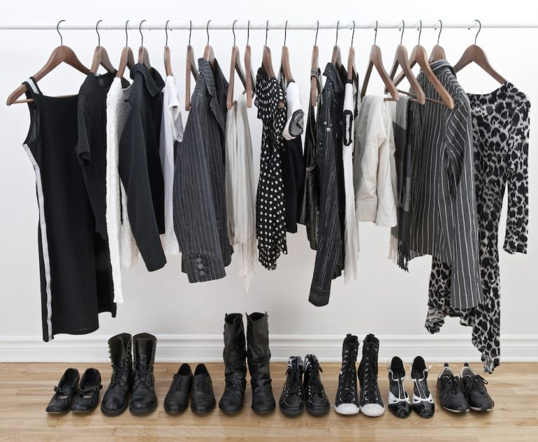
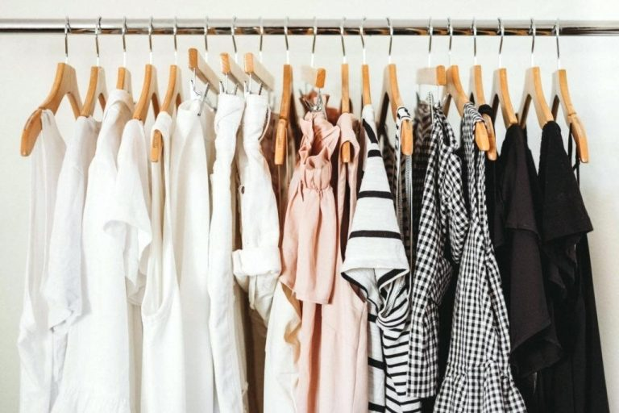

[Tối giản quần áo như thế nào – Life 30](https://life30.vn/toi-gian-quan-ao-nhu-the-nao/)

Sau khi quyết định sẽ phiêu lưu cùng Lối sống Tối giản, chúng ta bắt tay vào việc dọn dẹp căn phòng của mình. Và nơi đầu tiên, không đâu khác, chính là tủ quần áo. Chắc chắn vậy. 

Lý do chúng ta mua sắm nhiều quần áo chắc không cần phải nói nữa đâu nhỉ? Cơ bản có: vì mới lĩnh lương, vì mãi không có lương, vì mẫu đó mới ra, vì mẫu đó giảm giá, vì buồn, vì stress, vì đủ mọi lý do. Nên tủ quần áo luôn là nơi cần phải thanh lọc đầu tiên.

Có nhiều bạn muốn tối giản, nhưng không biết tối giản quần áo như thế nào? Nên bắt đầu từ đâu? Xử lí đám quần áo ra sao?

Hi vọng nội dung dưới đây sẽ giải đáp được những câu hỏi trên nhé.

Những thứ đầu tiên cần chuẩn bị khi lọc quần áo chính là TINH THẦN và THỜI GIAN. Đối với phụ nữ, tối giản quần áo là công việc không hề đơn giản. Thật vậy, không đùa đâu các bạn ạ. Đây là công việc đòi hỏi tập trung cao độ, các nơ ron thần kinh sẽ phải làm việc hết công suất đấy. Công việc này cũng sẽ khá tốn thời gian, nên hãy dành nguyên 1 hoặc 2 ngày nghỉ cho nó nhé. 

Đầu tiên, khi phải đối diện với cái tủ quần áo thế này, mặc dù rất chán nản và ngán ngẩm, nhưng việc các bạn cần làm, là hãy lấy mọi thứ ra khỏi tủ. Nhớ nhé, MỌI THỨ, không chừa thứ nào. Làm vậy sẽ giúp ta kiểm soát được tất cả mọi món đồ. Và sự thật phũ phàng là: ta cứ tưởng ta có ít quần áo lắm, nhưng khi lôi ra, nó đủ chất đầy 1-2, thậm chí 3 cái giường. 

Tiếp đó, hãy phân đồ của các bạn ra theo 3 nhóm như dưới đây. 

**Nhóm 1: Giữ lại**

– Những đồ bạn đang mặc thường xuyên

**Nhóm 2: Phân vân**

– Đồ ít mặc

– Đồ mình nghĩ vẫn còn cơ hội mặc

– Đồ kỉ niệm

**Nhóm 3: Thanh lí** 

– Đồ đã lỗi mốt

– Đồ rách, cũ, ố màu

– Đồ không thể mặc vừa 

Đối với nhóm 1: Là những món bạn đang mặc thường xuyên, tức là thích chúng, vậy hãy treo nó vào trong tủ và dùng tiếp

Đối với nhóm 2: Hãy gỡ nó xuống, để vào 1 cái hộp. Nếu khoảng nửa năm sau bạn vẫn không mặc đến, tức là nó không thực sự quan trọng, hãy thanh lí nó. Đồ kỉ niệm thì suy nghĩ kỹ xem nó có thật sự quan trọng với bạn không. Nếu có, hãy giữ lại.

Đối với nhóm 3: Thanh lí ngay vào luôn. Đồ đã lỗi mốt, đồ rách, cũ, ố màu có thể dùng làm khăn lau bàn, khăn lau nhà, lót ổ chó mèo, nhồi đệm ngồi của ghế v.v…. Đồ không thể mặc vừa hãy mang quyên góp, bán thanh lí v.v….

Bước này sẽ tiêu tốn của bạn nhiều sức lực và nơ ron thần kinh nhất. Hãy NÓI KHÔNG với những suy nghĩ kiểu như:

– _Mình mua bộ này lúc 47kg, giờ 53kg rồi, chờ giảm cân thì mặc_ —–> No way, không bao giờ. Bạn có giảm được cân chắc cũng không muốn mặc lại đâu, vì lỗi mốt, vì chất liệu, vì màu sắc v.v….

– _Mấy đồ này còn tốt, giữ lại nhỡ có lúc dùng_ —–> KHÔNG nhá. Còn tốt thì bạn hãy mang quyên góp. Cái khả năng “nhỡ có lúc” này ít khi xảy ra lắm. 

Vậy đấy, hãy hành động DỨT KHOÁT, QUYẾT ĐOÁN haha. Nghe có vẻ căng thẳng đúng không? Nhưng lời khuyên này không thừa đâu. Vì mình đã từng có những suy nghĩ đấy trong lần dọn tủ đầu tiên. Kết quả là đám đồ gần như không vơi đi tẹo nào, mình giữ lại gần hết đám đồ, với những lý do “Bao giờ giảm cân rồi mặc”, “Cái này vẫn đẹp vẫn tốt” v.v… Hãy thật sự dứt khoát nhé. 

Cứ làm như vậy đi. Và sau 1 ngày dọn dẹp, tủ đồ của bạn sẽ vơi đi đáng kể đấy. 

Những câu hỏi xoắn não khi tối giản quần áo.

**1\. Thanh lí hết quần áo rồi, còn có vài món đồ, vậy biết kết hợp ra sao? Chả lẽ cứ mặc đi mặc lại suốt?**

Để trả lời câu hỏi này, trước khi thanh lí quần áo, các bạn nên tìm cho mình 1 phong cách ăn mặc mà bạn thấy PHÙ HỢP nhất, THOẢI MÁI nhất. Khi đã định hình style rồi, hãy học thêm cách kết hợp các món đồ và phụ kiện với nhau. Ví dụ 1 cái áo có thể phối cùng 2 cái quần, 1 cái váy ngắn, 1 cái váy dài. Như vậy bạn có 4 bộ đồ, với 5 items, thay vì với 8 items như thông thường. Giảm được 3 items rồi đấy. Có được style rồi, việc quyết định giữ lại cái gì, bỏ đi cái gì sẽ dễ dàng hơn nhiều. Mình đã từng thấy có bạn kết hợp được 40 bộ đồ với 13 cái quần + áo. 

Có thể sẽ có người cảm thấy nhàm chán khi mặc đi mặc lại đồ. Còn cá nhân mình không thấy vậy, bởi đây là vấn đề của sự lựa chọn. _**Bạn thích tối giản quần áo để hướng tới sự đơn giản, tiện lợi, tiết kiệm thời gian, tiền bạc? hay Bạn thích làm quý cô thời trang đa phong cách? Lựa chọn hướng đi nào, thì hãy chấp nhận cả lợi ích và những mặt hạn chế của nó.**_ 

**2\. Quần áo với hai màu đen trắng mới là quần áo tối giản?**

**_Tối giản quần áo là giảm số lượng quần áo của bạn xuống mức tối đa, bằng cách kết hợp ra nhiều kiểu mặc với 1 số lượng quần áo ít ỏi, và bạn cảm thấy Thoải Mái, Tự Tin trong những bộ trang phục đó._**

Và để có thể kết hợp được đa dạng, dễ dàng, biến hoá, Đen và Trắng là 2 màu thần thánh nhất. Đồng thời, 2 màu này không kén độ tuổi, tuổi nào cũng có thể mặc được. Người sống theo lối sống tối giản thường mặc nhiều 2 màu này là vì thế đó. 

Bản thân mình trước đây là girl bánh bèo chính hiệu, 25 tuổi vẫn đội mũ hồng, mặc áo hồng, đeo túi hồng, đi giày hồng. Đến mức 1 cậu bạn người Pháp nhìn thấy mình phải thốt lên: “You like pink?” 

Nhưng hiện giờ, tủ quần áo của mình cũng chỉ có 2 màu chủ đạo là đen với trắng, thêm vài cái màu be và màu nâu xám. 

Bạn cũng có thể giữ tông màu chủ đạo của bạn là Hồng hoặc Tím hoặc Vàng. Nhưng với những màu này, việc kết hợp quần áo và phụ kiện khó khăn hơn Đen và Trắng. Đồng thời, bạn sẽ mất nhiều thời gian và tiền bạc để điều chỉnh nó theo độ tuổi, tính chất công việc v.v…

Trên đây là một số chia sẻ của mình về việc tối giản quần áo. Có thể chưa đầy đủ, mình sẽ hoàn thiện hơn trong những bài viết sau.

Một lần nữa, phải nhấn mạnh rằng, không có quy chuẩn bất di bất dịch. Các bạn có thể tham khảo cách của mình, và tìm ra cách phù hợp nhất với cá nhân bạn nhé.

Và quan trọng nhất, các bạn phải luôn nhớ trong đầu rằng: _**Hoàn toàn có thể ăn mặc thời trang khi Tối giản. Tối giản không bao giờ làm mất gu ăn mặc.**_ Victoria Beckham, người phụ nữ mình rất thích, nhà thiết kế thời trang, cũng là người theo trường phái Tối giản. Vậy hãy cứ take it easy và tự tin với lựa chọn của mình nhé.