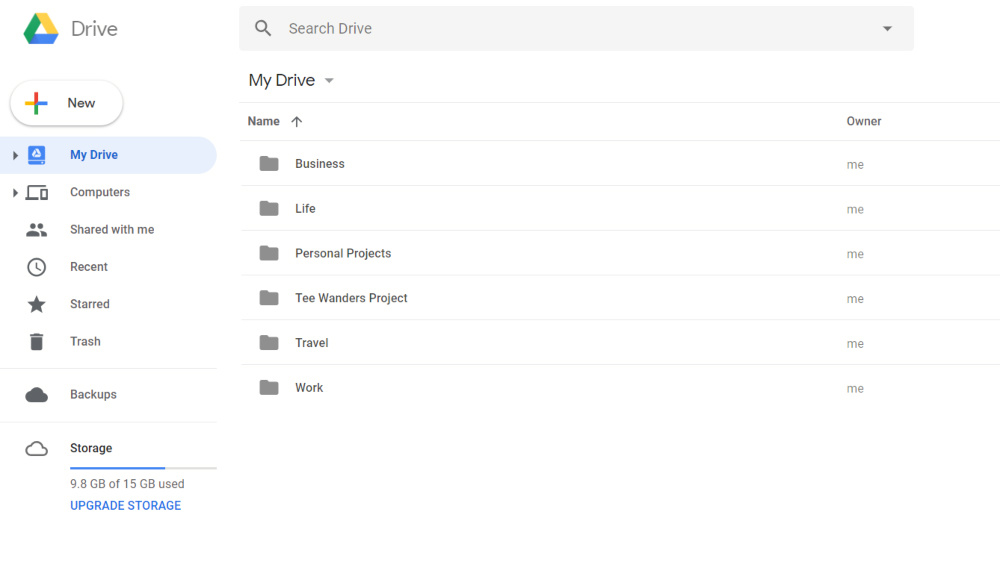

# Digital Minimalism: Đơn giản hóa cuộc sống số

!!! info "Bài viết gốc"
    [Digital Minimalism: Đơn giản hóa cuộc sống số](https://spiderum.com/bai-dang/Digital-Minimalism-Don-gian-hoa-cuoc-song-so-hnc)

Tôi từng bị choáng ngợp và mất kiểm soát do lạm dụng công nghệ, Internet hồi còn là sinh viên, lúc bản thân vẫn chưa hề biết đến lối sống tối giản.

Trong quá trình thực tập lối sống này, tôi bắt đầu quan tâm đến cách mình sử dụng công nghệ và các thiết bị điện tử, rồi từ đó biết được những thói quen xấu mình cần bỏ ngay và những thói quen mới, lành mạnh mình cần tạo lập.

Khi nói đến lối sống tối giản, chúng ta không chỉ nói về một không gian sống với thật ít đồ đạc, vật chất mà còn nói về một đời sống tinh thần giản đơn, lành mạnh, không bị phụ thuộc hay chi phối bởi công nghệ, điện tử. Thế nên, với tôi, “cuộc sống số” cũng quan trọng chẳng kém gì cuộc sống đời thường. Nó cũng cần được chăm sóc, được tổ chức và dọn dẹp thường xuyên. Dưới đây là một số cách tôi thực hiện để đơn giản hóa cuộc sống số của mình, hi vọng sẽ hữu ích cho bạn phần nào đấy.

## Máy tính

### Màn hình nền (desktop)

Nhiều người thường có thói quen lưu các tập tin ra ngoài màn hình để có thể dễ dàng truy cập khi cần thiết. Nhưng hãy nhớ là đừng lưu quá nhiều và quá ồ ạt nhé! Bạn nên cân nhắc chỉ lưu những tập tin quan trọng và xóa chúng đi nếu không còn quan trọng hoặc chuyển vào các ổ dữ liệu trong máy.

Ngày trước, hồi đi làm, tôi rất lười chọn vị trí lưu trữ tài liệu trước khi tải về mà cứ thế lưu luôn lên màn hình máy tính để đỡ phải lục tìm lâu la, mất thời gian. Vậy là theo thời gian, 2 chiếc màn hình trước mặt ngày càng chi chít những file ảnh, video, pdf các kiểu (máy tính của tôi ở công ty được gắn hai màn hình để hỗ trợ việc viết bài, chỉnh sửa hình ảnh, video).

Thế nên cứ mỗi buổi sáng đến công ty, vừa mở máy tính lên đã thấy ngột ngạt rồi, chưa kể đến việc tìm tài liệu mình cần những lúc ấy chẳng khác gì mò kim đáy biển.

Từ khi đi theo chủ nghĩa tối giản, tôi cảm thấy cuộc sống bắt đầu có tổ chức hơn, không còn vội vã và bừa bộn như lúc trước nữa. Màn hình máy tính không còn những file lẻ tẻ, đủ loại trên đời, mà chỉ có đúng 5 ứng dụng tôi thường truy cập nhất. Tôi cũng chọn background đơn giản, với tông màu tối, nhẹ nhàng. Điều này giúp tôi dễ tập trung làm việc hơn và đôi mắt cũng cảm thấy dễ chịu khi nhìn vào.

### Các thư mục, tập tin, dữ liệu lưu trữ

Các tập tin của tôi trong máy tính không có nhiều, vì tôi thường lưu chúng trên các ứng dụng lưu trữ trực tuyến như Google Drive và Dropbox. Do tính chất công việc nên hiện tại tôi chủ yếu dùng Google Drive là chính. Điểm hay của Drive là tôi có thể truy cập tài liệu của mình ở bất cứ nơi nào có Internet và chia sẻ tài liệu với bạn bè, đồng nghiệp một cách nhanh chóng, thuận tiện.

Với những dữ liệu trong máy tính, tôi tổ chức chúng vào thư mục phù hợp để có thể dễ dàng tìm thấy lúc cần. Những tập tin cần tải về sẽ được cho vào đúng thư mục đã chọn ngay trước hoặc sau khi nhấn nút “lưu”. Những tấm hình tôi chụp bằng điện thoại hay máy ảnh cũng sẽ được chọn lọc kỹ càng trước khi lưu vào album trong máy tính. Ảnh giống nhau, ảnh mờ, kém chất lượng sẽ bị xóa đi. Việc sắp xếp hình ảnh theo thời gian, địa điểm hay sự kiện cũng là một việc cần thiết sau khi chuyển lên máy tính.

Ngoài ra, tôi cũng rèn luyện cho mình thói quen dọn dẹp dữ liệu máy tính vào mỗi cuối tháng. Những tài liệu không còn cần thiết sẽ được xóa vĩnh viễn thay vì cho chúng vào thùng rác (Trash). Gom các thư mục liên quan vào cùng một thư mục mẹ để tránh trường hợp máy tính có quá nhiều thư mục nhỏ khác nhau. Loại bỏ những thư mục rỗng và đổi tên các thư mục đang được để “New Folder”. Những tài liệu nào quan trọng hay thường xuyên truy cập sẽ được chuyển lên Google Drive để tránh trường hợp máy tính hư hỏng hay bị mất.

### Phần mềm, tiện ích

Khi mà thế giới công nghệ trở nên phát triển hơn thì càng xuất hiện nhiều ứng dụng, phần mềm thông minh và cực kỳ tiện ích. Tuy nhiên, bạn hãy nhớ tìm hiểu kỹ trước khi tải bất kỳ phần mềm nào về máy tính của mình bởi nếu không cẩn thận, chúng ta hoàn toàn có thể dính vào những phần mềm “độc hại” của các đối tượng xấu.

Tốt hơn hết là chỉ tải những phần mềm mình thực sự thấy cần thiết và từ những nguồn đáng tin cậy. Điều này sẽ vừa giúp máy tính tránh được nguy cơ bị nhiễm virus, lại vừa giúp không gian số của mình thêm gọn gàng, sạch sẽ. Hiện tại trong máy tính của tôi chỉ có vài ba phần mềm quan trọng nhất, và được dùng thường xuyên như Chrome, Skype, và Slack. Số còn lại là những chương trình mặc định của Window.

Ngoài ra, việc dành thời gian gỡ bỏ những phần mềm, chương trình cũ hay không dùng đến cũng rất quan trọng. Vì nó sẽ giúp giải phóng bộ nhớ hệ thống, nâng cao hiệu suất hoạt động cho máy tính. Nhớ là phải gỡ bỏ đó nhé, vì nếu bạn chỉ xóa shortcuts thôi thì sẽ chẳng có tác dụng gì cả.

## Điện thoại, máy tính bảng

### Màn hình điện thoại

Giống như màn hình desktop, màn hình điện thoại, Ipad cũng thường xuyên được dọn dẹp bằng cách nhóm những ứng dụng liên quan lại với nhau vào cùng một thư mục, để mắt có thêm không gian trống mà thở, mà nhìn. Một màn hình với đầy những ứng dụng khác nhau sẽ chỉ khiến bản thân thêm mệt mỏi, không tốt cho mắt mà lại mất thời gian lục tìm.

### Các ứng dụng và thông báo

Dù bộ nhớ có lớn đến đâu thì việc tải quá nhiều ứng dụng về cũng sẽ không tốt cho chiếc điện thoại của chúng ta chút nào. Vậy nên, thường thì tôi chỉ tải về những ứng dụng mà bản thân thấy thực sự hữu ích, thay vì tải tràn lan để dùng thử rồi lại bỏ xó, không thèm ngó ngàng gì mà quên mất gỡ nó đi.

Cứ sau một thời gian, tôi lại ngó qua một lượt tất cả mọi ứng dụng trên chiếc điện thoại của mình và xóa đi những ứng dụng lâu ngày không còn dùng, không còn cần thiết.

Ngoài ra, hầu hết các ứng dụng đều cho phép người dùng tùy chọn chế độ thông báo (Notifications), nên khi tải chúng về, tôi lại mò vào chỗ Cài đặt để thiết lập lại tần suất và thời gian nhận tin cập nhật. Cái nào thấy không cần thiết thì tắt hẳn luôn, đỡ phải nghe tiếng tintin cứ mỗi vài giờ đồng hồ.

### Các tập tin video, âm thanh, hình ảnh

Nếu bạn là người yêu thích chụp ảnh, hay quay phim thì hẳn bạn cũng như tôi, cực kỳ sung sướng khi bắt gặp mấy khoảnh khắc đẹp mê hồn, để rồi lại lôi điện thoại ra mà chụp lấy chụp để, mong sao có được tấm hình ưng ý nhất.

Ngày xưa trước khi dùng máy film, tôi cũng ham chụp và chụp rất nhiều, rồi để đến lúc nhìn lại, một loạt ảnh hao hao nhau nhưng không nỡ xóa vì “tấm nào cũng đẹp”. Vậy là album ảnh cứ nhiều lên mỗi ngày khiến cho việc tìm một tấm ảnh đẹp để gửi cho đứa bạn thân trở nên khó khăn kinh khủng.

Giờ thì mọi thứ đơn giản hơn nhiều, một phần là vì tôi ít chụp ảnh hơn mà dành thời gian để ngắm nhìn, để tận hưởng khoảnh khắc đẹp đó (nếu có thì chụp bằng máy phim), phần nữa là vì tôi đang rèn luyện thói quen chỉ giữ lại tấm hình “ổn” nhất và xóa hết những tấm khác đi ngay sau mỗi lần chụp. Không còn do dự hay băn khoăn chi cả, vì quan trọng vẫn là ký ức, là cảm giác, là khoảnh khắc lưu giữ ở trong tâm trí chứ đâu phải ở trong những tấm hình.

Tôi cũng thường xuyên chuyển ảnh và video lên Google Drive hoặc Flickr để giải phóng bộ nhớ cho điện thoại.

Nhạc và Podcast cũng được dọn dẹp thường xuyên. Tôi dùng ứng dụng Spotify để nghe nhạc nên sẽ không cần tải nhạc về khiến dung lượng máy thêm nặng và khó quản lý các file nhạc. Podcast thì tôi chỉ [đăng ký những kênh có ích với mình (mang giá trị giáo dục hoặc truyền cảm hứng)](youtube-va-podcast.md) như Ted talks, French Easy, Optimal Living, The Minimalists,… còn hủy đăng ký tất cả những kênh khác. Một điều khá hay ở Podcast những tập sau khi nghe xong sẽ tự động được xóa đi, thế nên tôi sẽ không cần phải mất thời gian tìm kiếm và xóa chúng nữa.

## Danh sách liên lạc

Khi nói về việc dọn dẹp điện thoại, có lẽ ít ai nghĩ đến việc dọn dẹp danh bạ của mình. Ngày trước tôi cũng vậy. Là một người sống nhiều với cảm xúc, thi thoảng việc xóa đi một cái tên trong danh bạ điện thoại của mình trở nên khá khó khăn. Vì tôi sợ, xóa nó đi là xóa cả ký ức về người đó, xóa chính họ ra khỏi cuộc đời của tôi. Vậy nên lúc đó, danh bạ của tôi có rất rất nhiều cái tên và con số. Điều này khiến việc tìm được người cần liên lạc thành ra mất thời gian. Khi chọn cuộc sống đơn giản, tôi chọn giữ lại cho riêng mình những gì quan trọng nhất và buông bỏ tất cả mọi thứ làm nặng tâm trí mình. Cứ sau một thời gian, tôi lại mở danh bạ điện thoại ra và xóa đi những cái tên đang dần trở nên xa lạ. Đấy cũng là một cách để sống giản đơn.

Bạn đã từng mở danh bạ lên và thấy những cái tên vừa quen vừa lạ? Rồi cảm thấy chút lâng trong lòng khi nghĩ về những ngày trước, hóa ra người đó và mình đã từng trò chuyện, từng rất thân với nhau? Cuộc sống đổi thay và việc một mối quan hệ trở nên nhạt phai theo thời gian là điều dễ hiểu. Vậy nên, dọn dẹp lại danh bạ điện thoại của bạn cũng là một việc cần và nên làm để sống nhẹ nhàng hơn.

## Internet

### Email

Email cũng là một phần không thể thiếu trong công cuộc dọn dẹp không gian số của tôi, vì thời gian tôi dành cho việc check mail “đã từng” rất nhiều, như là một thói quen vậy.

**_Về tài khoản email:_** Nếu như trước đây, tôi có tới 4, 5 tài khoản email để phục vụ cho những nhu cầu và mục đích khác nhau, thì bây giờ tôi chỉ dùng vỏn vẹn 2 tài khoản (một cái để liên lạc cá nhân và cái kia dành cho công việc). Việc cắt giảm tài khoản email giúp tôi tiết kiệm thời gian, vì không phải kiểm tra hòm thư nhiều lần.

**_Về quản lý và tổ chức email:_**

- Tôi hủy đăng ký nhận những email marketing mà bản thân thấy không hữu ích, hoặc thấy quá phiền hà.
- Tôi cũng tạo cho mình thói quen xử lý email ngay khi vừa xem xong để tránh tình trạng hộp thư bị đầy, quá tải bằng cách sắp xếp chúng vào từng nhóm hợp lý và xóa đi những email không còn cần giữ lại.
- Thư rác là một vấn đề gây khá nhiều nhức nhối tới tôi. Nên để tránh vấn đề này, tôi đã thiết lập tính năng tự động lọc và xóa thư rác trên Gmail. Hầu hết tất cả các dịch vụ email như Gmail, Hotmail, iCloud Mail đều có cung cấp tính năng này. Bạn có thể tìm hiểu hướng dẫn thiết lập tính năng trên Google nếu chưa biết cách.

**Về thời gian kiểm tra email:** Cắt giảm thời gian và tần suất kiểm tra email cũng rất quan trọng. Thay vì cứ mở mail một cách vô tội vạ như trước thì bây giờ tôi lại xem nó như một việc cần làm trong ngày và cố định thời gian thực hiện nó. Tôi kiểm tra email không quá hai lần mỗi ngày – cuối buổi sáng và cuối buổi tối. Thời gian dành cho việc xử lý email nhiều nhất là 25 phút. Chính việc này đã phần nào giúp tôi trở nên kỷ luật với bản thân mình hơn, và có thêm thời gian cho những việc quan trọng khác.

### Các ứng dụng lưu trữ dữ liệu trực tuyến (Google Drive, Dropbox)

Tôi có dùng Google Drive và Dropbox để lưu trữ tài liệu của mình vì tính tiện lợi và an toàn của chúng. Tương tự như với máy tính, dữ liệu trên các ứng dụng này cũng được tôi tổ chức thành các thư mục để thuận tiện cho việc truy cập. Đồng thời, những tài liệu không còn cần thiết cũng được xóa đi, nhường chỗ cho tài liệu mới. Trong Google Drive có mục “Shared with me”, đây là nơi lưu trữ những tài liệu mà người khác chia sẻ và chúng không thể được tổ chức thành các thư mục lớn, nhìn rất khó chịu. Nên khi xử lý phần này, tôi hoặc là thêm chúng vào Drive của mình rồi phân thành nhóm hoặc xóa đi nếu thấy không cần thiết.

### Mạng xã hội

Thành thực thì tôi không thích dùng mạng xã hội cho lắm. Hiện tại tôi chủ yếu dùng Messenger để giữ liên lạc với gia đình, bạn bè, Instagram, Pinterest cho mục đích công việc và YouTube để giải trí, học hỏi. Thời gian tôi dành cho mạng xã hội không thực sự nhiều so với những người được xem là kẻ sống “ảo”. Vậy mà chúng cũng đã khiến tôi mất tập trung không ít lần. Thế nên để giúp cuộc sống thêm nhẹ nhàng, ý nghĩa, tôi luôn cố gắng để cắt giảm nhiều nhất có thể thời gian sử dụng mạng xã hội của mình, đồng thời quản lý thật chặt chẽ những nội dung xuất hiện trên những trang đó.

- **_Quản lý danh sách bạn bè và người theo dõi:_** Tôi chỉ chấp nhận lời mời kết bạn của những ai thực sự quen biết, theo dõi những ai có cùng chung giá trị sống với mình và hủy kết bạn hoặc hủy theo dõi với những người không quen, những người thường xuyên chia sẻ nội dung tiêu cực, nặng nề, không có ý nghĩa. Hiện tại trong danh sách bạn bè Facebook của tôi có chưa đến 200 người, và họ đều là những người hoặc thân thiết, gần gũi với tôi hoặc mang lại giá trị cho cuộc đời của tôi (như kiến thức, trải nghiệm, cảm hứng, động lực,…)
- **_Quản lý những trang đã thích/ nhóm Facebook đã tham gia:_** Tôi muốn tất cả những gì hiện trên newsfeed của mình đều là những điều bản thân muốn đọc, muốn mọi thông báo hiện lên đều là những cập nhật cần thiết. Thế nên các trang và nhóm tôi tham gia thường là những nơi tôi có thể chia sẻ, học hỏi và kết nối. Cứ sau một thời gian, tôi lại dọn dẹp Facebook của mình, ra khỏi những nhóm mình không thường xuyên hoạt động, bỏ thích những trang không còn cần thiết, chọn chế độ tắt những thông báo không liên quan đến mình. Với YouTube thì sẽ là hủy theo dõi những kênh mình không xem, và cả những kênh không mang lại giá trị, bật chế độ hạn chế (Restricted Mode), xóa lịch sử xem, lưu lại những video cần xem lại vào danh sách xem (playlist) phù hợp.

### Bookmark trên trình duyệt

Tôi thường thích bookmark lại những trang web quan trọng để có thể dễ dàng xem lại vào lần sau, đỡ mất công gõ tìm lại. Nên việc tổ chức bookmarks gọn gàng cũng là một việc cần được chuyển thành thói quen. Những trang web có liên quan sẽ được cho vào cùng một thư mục để dễ tìm, và những trang không còn cần thiết nữa sẽ được gỡ bỏ hết.

## Máy đọc sách Kindle

Bên cạnh máy tính, điện thoại thì còn một thiết bị điện tử nữa mà tôi có dùng (gần như hằng ngày). Đấy là chiếc máy đọc sách Kindle Paperwhite tôi có đặt hàng từ Amazon hồi năm ngoái. Trước khi dùng máy đọc sách, chủ yếu tôi đọc sách giấy hoặc đọc sách điện tử trên ứng dụng Kindle trong điện thoại. Giờ thì có Kindle rồi, tha hồ đọc. Tôi thường hay gọi nó là Ken, và có viết một bài dành riêng cho Ken cũng như các bạn Kindle khác nói chung trên blog, bạn có thể đọc nếu quan tâm.

### File sách, tài liệu đọc

Tôi luôn sắp xếp các cuốn sách mình đọc vào đúng bộ sưu tập của chúng (collection) để có thể dễ dàng tìm kiếm và giúp trang chủ của Ken cũng trở nên gọn gàng, ngăn nắp hơn. Các bộ sưu tập được tôi đặt tên theo thể loại sách (như thơ, truyện ngắn, tiểu thuyết kinh điển, hồi ký tự truyện, du ký,…). Sau khi đọc xong, những sách tôi không có ý định đọc lại hay nghiên cứu thêm thì sẽ được xóa đi. Tôi xóa trực tiếp trên Cloud của Amazon thay vì chỉ xóa trên thiết bị để tránh trường hợp Cloud quá tải với quá nhiều sách không còn cần thiết với mình.

## Cân bằng nhịp sống số (Digital Detox)

Phải nói là những thiết bị điện tử giúp tôi cực kỳ nhiều trong cuộc sống, học tập và cả công việc. Tuy nhiên thời gian sử dụng chúng lại là một điều tôi luôn cố gắng hạn chế nhiều nhất có thể.

- Trong ngày, tôi chỉ cho phép mình dùng công nghệ vào một vài thời điểm nhất định và với một lượng thời gian phù hợp. Điện thoại không được sử dụng trước 8h sáng, và sau 9h tối. Để mắt nghỉ ngơi, thư giãn sau mỗi 45 phút ngồi trước máy tính bằng cách đi bộ, vận động cơ thể, hoặc đơn giản là khép mắt lại.
- Gỡ Facebook và các ứng dụng giải trí ra khỏi điện thoại để tránh bị xao nhãng (và cám dỗ).
- Dành thời gian cho các hoạt động khác như thiền, yoga, chạy bộ, đi dạo, viết lách, vẽ vời, học guitar, làm bánh, chụp ảnh để cân bằng cuộc sống.
- Có một hoặc vài ngày trong tuần hoàn toàn không dùng Internet, không vào các mạng xã hội. Đồng thời, một trong những nguyên tắc của tôi là không dùng điện thoại trong bữa ăn, lúc trò chuyện với người khác hay lúc đang dành thời gian cho riêng bản thân.

Sống tối giản về bản chất là sống có ý thức. Chúng ta biết đâu là những điều có ý nghĩa mình cần chú tâm, và đâu là những điều vô bổ, không cần thiết mình cần loại bỏ. Dù là đời sống vật chất, tinh thần hay đời sống số thì việc dọn dẹp nó thường xuyên sẽ giúp chúng ta luôn cảm thấy an yên, tĩnh tại.

Tất nhiên trên đây chỉ là những cách tôi áp dụng, còn có thể vẫn có nhiều cách khác nữa, hiệu quả hơn mà tôi chưa biết đến. Vậy nên, hãy nhớ chia sẻ cách bạn thường dùng để tối giản hóa cuộc sống số nghen.

Cảm ơn bạn.

_Just be,_
